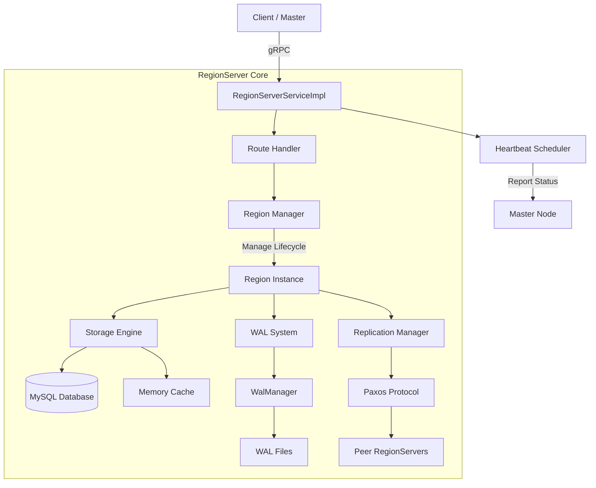

# MiniSQL RegionServer 详细设计文档

## 1. 概述 (Overview)

**RegionServer** 是分布式 MiniSQL 系统的核心数据节点，负责实际的数据存储、查询执行以及 Region 的生命周期管理。它遵循 Master-RegionServer 架构，由 Master 节点统一调度，通过 gRPC 协议与 Client 和 Master 进行通信。

### 1.1 核心职责

- **数据存储**: 支持基于 MySQL 的持久化存储和基于内存的快速读写。
- **CRUD 操作**: 提供 `Put`, `Get`, `Delete`, `Exists` 等基础数据操作。
- **批量与扫描**: 支持 `BatchPut/BatchGet/BatchDelete` 以及流式 `Scan` 范围查询。
- **Region 管理**: 处理 Region 的打开 (`OpenRegion`)、关闭 (`CloseRegion`) 和迁移 (`MigrateRegion`)。
- **高可用与一致性**: 集成 WAL (Write-Ahead Logging) 日志系统，基于 Paxos 协议实现多副本强一致性同步。
- **心跳与注册**:向 Master 注册自身状态并定期发送心跳。

### 1.2 技术栈

- **语言**: Java 11+
- **通信**: gRPC + Protocol Buffers
- **存储引擎**: MySQL (JDBC/HikariCP) + Memory (TreeMap for caching/testing)
- **一致性协议**: Paxos (Proposer/Acceptor 模型)
- **日志框架**: SLF4J + Logback
- **构建工具**: Maven

------

## 2. 系统架构 (Architecture)

RegionServer 内部采用分层架构设计，主要包含以下模块：



### 2.1 模块说明

1. **[RegionServerMain](javascript:void(0))**: 入口类，负责启动 gRPC Server，初始化配置，连接 Master，启动心跳线程 and CLI 交互界面。
2. **[RegionServerServiceImpl](javascript:void(0))**: gRPC 服务实现层，接收客户端请求，进行参数校验，路由到具体的 Region 处理器。
3. **`RegionManager`**: 管理当前节点上所有加载的 Region 实例，处理 `Open/Close/Migrate` 命令。
4. **`Region`**: 逻辑数据单元，封装了针对特定表片段的操作，协调存储、WAL 和复制。
5. **`StorageEngine`**: 抽象存储接口，目前实现包括 `MySqlStorage` 和 `MemoryStorage。
6. **`WalManager`**: 负责 WAL 日志的写入、轮转和恢复。
7. **`ReplicationManager`**: 管理副本拓扑，协调主从同步。
8. **`PaxosAcceptor/Proposer`**: 实现分布式共识协议，确保多副本数据一致性。

------

## 3. 核心组件详细设计

### 3.1 启动与初始化 (`RegionServerMain`)

**流程:**

1. **加载配置**: 读取 `regionserver.conf` 及环境变量。
2. **初始化服务**: 创建 `RegionServerServiceImpl` 实例。
3. **启动 gRPC Server**: 监听指定端口。
4. 连接 Master:
   - 建立 gRPC Channel 到 Master。
   - 发送 `RegisterRegionServerRequest`。
   - 获取分配的 `ServerId` 和心跳间隔。
5. **启动心跳线程**: 定时发送 `HeartbeatRequest`，携带负载指标（CPU, Memory, RegionCount）。
6. **启动 CLI (可选)**: 提供交互式命令行用于本地测试。

**关键代码逻辑:**

```java
// RegionServerMain.java
public void start() throws IOException {
    grpcServer = ServerBuilder.forPort(port).addService(service).build().start();
    connectToMaster(); // 注册并启动心跳
    logger.info("RegionServer {} started", regionServerId);
}
```

### 3.2 gRPC 服务实现 ([RegionServerServiceImpl](javascript:void(0)))

继承自 `RegionServerServiceGrpc.RegionServerServiceImplBase`，实现以下核心方法：

#### 3.2.1 数据操作

- [put(PutRequest, StreamObserver)](javascript:void(0)):
  1. 检查 Region 是否在线。
  2. 调用 `Region.put()`。
  3. 若启用 Paxos，发起提案；否则直接写入存储。
  4. 返回结果或错误码 (`DUPLICATE_KEY`, `REGION_NOT_ONLINE` 等)。
- [get(GetRequest, StreamObserver)](javascript:void(0)):
  1. 路由到对应 Region。
  2. 调用 `Region.get()` 从存储引擎读取数据。
  3. 返回列值映射。
- [scan(ScanRequest, StreamObserver)](javascript:void(0)):
  1. 验证 StartKey/EndKey。
  2. 调用存储引擎的迭代器接口。
  3. 分批返回结果，支持正向/反向扫描。

#### 3.2.2 Region 管理

- [openRegion(OpenRegionRequest, ...)](javascript:void(0)):
  1. 解析 [RegionInfo](javascript:void(0))。
  2. 创建新的 `Region` 实例。
  3. 初始化存储连接（MySQL Table 检查/创建）。
  4. 若存在 WAL，执行恢复重放。
  5. 将 Region 加入 `RegionManager` 映射表，状态设为 `ONLINE`。
- [closeRegion(CloseRegionRequest, ...)](javascript:void(0)):
  1. 将 Region 状态设为 `CLOSING`。
  2. Flush MemStore 到磁盘/MySQL。
  3. 关闭资源，从映射表移除。

#### 3.2.3 副本同步

- [applyReplicationLog(ApplyReplicationLogRequest, ...)](javascript:void(0)):
  1. 接收来自 Primary RegionServer 的 WAL 记录。
  2. 校验 Checksum。
  3. 应用到本地存储引擎。
  4. 更新水印 (Watermark)。

### 3.3 存储引擎设计 (`StorageEngine`)

采用策略模式，支持后端切换。

#### 3.3.1 MySQL 存储 (`MySqlStorage`)

- Schema 设计:

  每个 Region 对应一张物理表或共享大表带分区键。

  ```sql
  CREATE TABLE region_data_{regionId} (
      row_key VARBINARY(1024) PRIMARY KEY,
      family_qualifier VARBINARY(256), -- 列族:限定符
      value MEDIUMBLOB,
      timestamp BIGINT,
      version INT
  );
  ```

- **连接池**: 使用 HikariCP 管理 JDBC 连接。

- 操作:

  - [put](javascript:void(0)): `INSERT INTO ... ON DUPLICATE KEY UPDATE`
  - [get](javascript:void(0)): `SELECT value FROM ... WHERE row_key = ?`
  - [scan](javascript:void(0)): `SELECT ... WHERE row_key >= ? AND row_key < ? LIMIT ?`

#### 3.3.2 内存存储 (`MemoryStorage`)

- **结构**: `ConcurrentSkipListMap<byte[], Map<String, byte[]>>`
- **用途**: 单元测试、快速原型验证、缓存层。

### 3.4 WAL 日志系统 ([WalManager](javascript:void(0)))

为了保证数据持久性和副本同步，所有写操作先写 WAL。

- 日志格式:

  ```protobuf
  message WalRecord {
      int64 sequence_id = 1;
      string region_id = 2;
      OperationType type = 3; // PUT, DELETE
      bytes key = 4;
      map<string, bytes> columns = 5;
      int64 timestamp = 6;
      string checksum = 7;
  }
  ```

- 写入策略:

  - **Sync**: 每次写操作强制 `fsync` (安全性高，性能低)。
  - **Async**: 批量刷盘 (性能高，可能丢失少量数据)。

- **轮转机制**: 当文件大小超过阈值 (e.g., 64MB) 时，归档旧文件，创建新文件。

- **恢复机制**: Region 启动时，读取最后未归档的 WAL 文件，重放所有记录到存储引擎。

### 3.5 副本管理与 Paxos 共识

#### 3.5.1 角色定义

- **Primary (Leader)**: 处理客户端写请求，发起 Paxos 提案。
- **Secondary (Follower)**: 接收 Primary 的日志复制请求，作为 Acceptor 投票。

#### 3.5.2 Paxos 流程

1. **Prepare**: Proposer (Primary) 生成全局唯一 Proposal ID，发送给所有 Acceptors (包括自己)。
2. **Promise**: Acceptor 如果收到的 ID 大于已承诺的最大 ID，则返回 Promise，包含已接受的最大 Value (如果有)。
3. **Accept**: Proposer 收集多数派 Promise 后，确定 Value，发送 Accept 请求。
4. **Accepted**: Acceptor 接受提案，持久化日志，返回 Accepted。
5. **Commit**: Proposer 收集多数派 Accepted 后，通知所有节点 Commit，应用数据到存储引擎。

#### 3.5.3 故障处理

- **Primary 故障**: Master 检测到心跳超时，触发 Failover，选举新的 Primary。
- **Secondary 故障**: Primary 标记该副本为 `Unhealthy`，停止向其同步，待其恢复后通过 WAL 追赶数据。

------

## 4. 接口定义 (Interface Design)

基于 `minisql-common/src/main/proto/regionserver.proto`。

### 4.1 数据服务 (`RegionServerService`)

| 方法名                | 请求类型                                         | 响应类型                                          | 描述                     |
| :-------------------- | :----------------------------------------------- | :------------------------------------------------ | :----------------------- |
| `Put`                 | [PutRequest](javascript:void(0))                 | [PutResponse](javascript:void(0))                 | 插入或更新单行数据       |
| `Get`                 | [GetRequest](javascript:void(0))                 | [GetResponse](javascript:void(0))                 | 查询单行数据             |
| `Delete`              | [DeleteRequest](javascript:void(0))              | [DeleteResponse](javascript:void(0))              | 删除单行数据             |
| `Exists`              | [ExistsRequest](javascript:void(0))              | [ExistsResponse](javascript:void(0))              | 检查键是否存在           |
| `BatchPut`            | [BatchPutRequest](javascript:void(0))            | [BatchPutResponse](javascript:void(0))            | 批量插入                 |
| `Scan`                | [ScanRequest](javascript:void(0))                | `stream ScanResponse`                             | 范围扫描 (服务端流)      |
| `OpenRegion`          | [OpenRegionRequest](javascript:void(0))          | [OpenRegionResponse](javascript:void(0))          | Master 调用，加载 Region |
| `CloseRegion`         | [CloseRegionRequest](javascript:void(0))         | [CloseRegionResponse](javascript:void(0))         | Master 调用，卸载 Region |
| `ApplyReplicationLog` | [ApplyReplicationLogRequest](javascript:void(0)) | [ApplyReplicationLogResponse](javascript:void(0)) | 副本间同步 WAL           |

### 4.2 错误码 ([ErrorCode](javascript:void(0)))

- `OK`: 成功
- `REGION_NOT_FOUND`: Region 不存在
- `REGION_NOT_ONLINE`: Region 未就绪
- `DUPLICATE_KEY`: 主键冲突 (仅在严格模式下)
- `STALE_ROUTE`: 客户端路由缓存过期
- `INTERNAL_ERROR`: 内部服务器错误

------

## 5. 配置管理

配置文件: `src/main/resources/regionserver.conf`

```properties
# 基础信息
regionserver.id=rs-001
regionserver.port=8001
regionserver.host=0.0.0.0

# Master 连接
master.host=localhost
master.port=8000
master.heartbeat.interval.ms=3000

# 存储配置
storage.backend=mysql # memory or mysql
mysql.host=localhost
mysql.port=3306
mysql.database=minisql
mysql.username=root
mysql.password=password
mysql.connection.pool.size=10

# Region 限制
region.max.size.mb=256
region.memstore.flush.threshold.mb=64

# WAL 配置
wal.enabled=true
wal.path=./wal
wal.sync.policy=SYNC # SYNC or ASYNC

# 线程池
thread.pool.size=20
```

------

## 6. 异常处理与容错

1. **网络异常**: gRPC 连接断开时，自动重试连接 Master。心跳失败超过阈值后，Master 会将该 RS 标记为下线。

2. **存储异常**: MySQL 连接失败时，尝试重连。若多次失败，Region 进入 `ERROR` 状态并向 Master 报告。

3. **数据不一致**: 通过 Paxos 协议保证写操作的原子性。读操作可能读到旧数据（取决于隔离级别），通常采用 Read-Your-Writes 策略或通过版本号控制。

4. Region 分裂: 

   当 Region 大小超过阈值，触发分裂流程：

   - 停止服务 (Brief Pause)。
   - 计算 Split Key。
   - 创建两个子 Region。
   - 异步迁移数据。
   - 向 Master 报告分裂完成，更新路由表。

------

## 7. 测试策略

### 7.1 单元测试

- **目标**: 验证单个组件逻辑。
- **工具**: JUnit 5, Mockito.
- 案例:
  - `MemoryStorageTest`: 验证 Put/Get/Delete 逻辑。
  - [WalManagerTest](javascript:void(0)): 验证日志写入和恢复。
  - [PaxosAcceptorTest](javascript:void(0)): 验证投票逻辑。

### 7.2 集成测试

- **目标**: 验证模块间交互。
- 案例:
  - [RegionServerServiceImplTest](javascript:void(0)): 启动嵌入式 gRPC Server，模拟 Client 请求。
  - `ReplicationIntegrationTest`: 启动多个 RS 实例，验证主从同步。

### 7.3 端到端测试

- **目标**: 验证完整业务流程。
- 场景:
  - 集群启动 -> 创建表 -> 插入数据 -> 查询数据 -> 模拟节点宕机 -> 验证数据可用性。

------

## 8. 部署与运维

### 8.1 启动脚本

- Linux: [start-regionserver.sh](javascript:void(0))
- Windows: [start-regionserver.bat](javascript:void(0))

### 8.2 监控指标

通过 Heartbeat 上报以下指标至 Master:

- `region_count`: 加载的 Region 数量
- `total_size_bytes`: 数据总大小
- `cpu_usage`: CPU 使用率
- `memory_usage`: JVM 堆内存使用率
- `qps`: 每秒查询数
- `active_connections`: 活跃 gRPC 连接数

### 8.3 日志管理

- **主日志**: `logs/regionserver.log` (INFO 级别)
- **错误日志**: `logs/regionserver-error.log` (ERROR 级别)
- **轮转策略**: 按天轮转，保留 30 天，最大总大小 1GB。

------

## 9. 后续优化方向

1. **Block Cache**: 引入 LRU Block Cache 加速热点数据读取。
2. **Compaction**: 实现后台 Compaction 线程，合并小文件，清理删除标记。
3. **索引优化**: 支持二级索引，加速非主键查询。
4. **负载均衡**: 配合 Master 实现更智能的 Region 自动迁移策略。