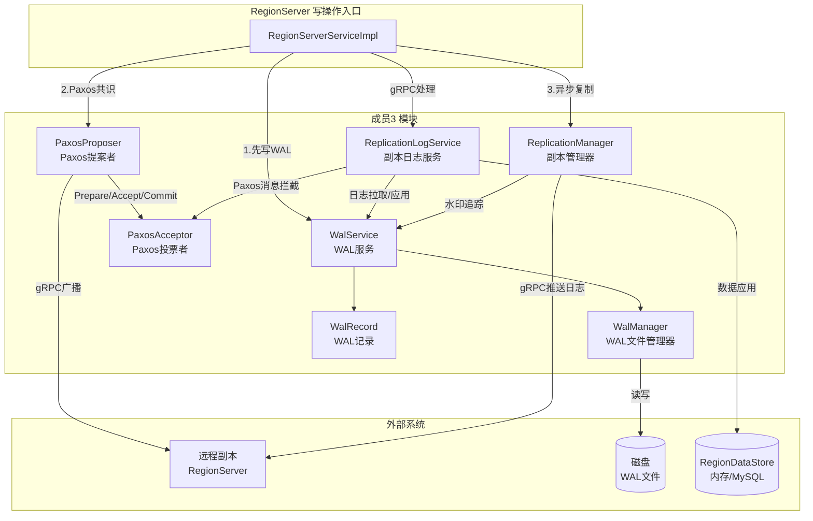
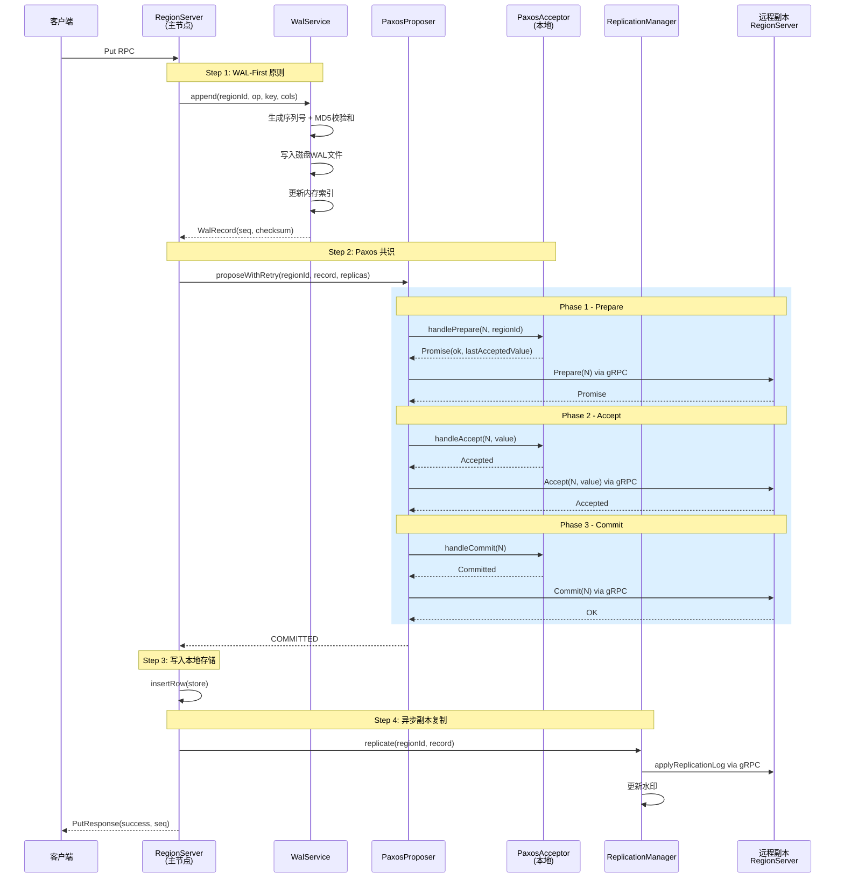
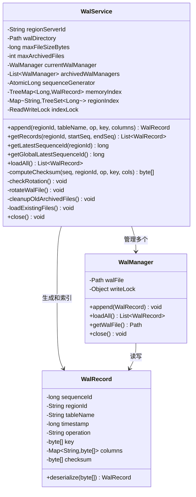
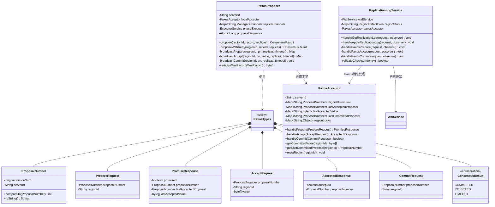
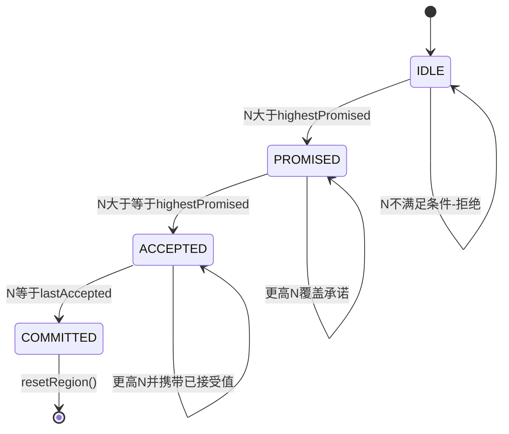
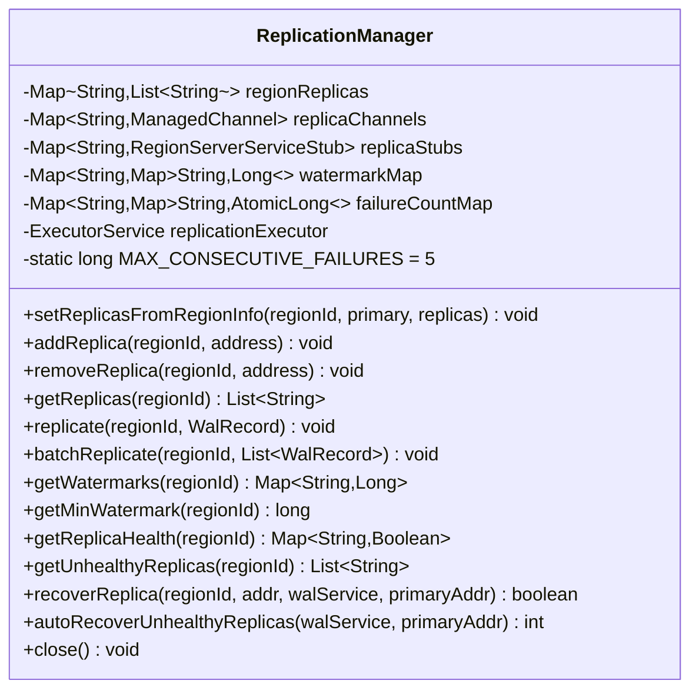
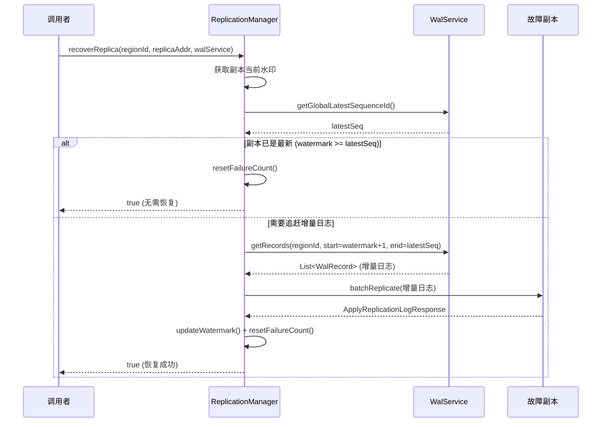

# 副本管理与一致性协议模块设计报告

> **成员3：副本管理与一致性协议开发**  
> **模块名称：Replication & Consensus Module**  
> **所属项目：Distributed MiniSQL**  
> **周赫        3230106011**

---

## 一、引言

### 1.1 项目背景

Distributed MiniSQL 是一个教学用途的分布式关系型数据库系统，采用 Master-RegionServer 架构，支持数据分片、副本管理、负载均衡、分布式查询等核心功能。系统使用 MySQL 作为底层存储引擎，在其之上构建分布式层。

### 1.2 模块定位

本模块（副本管理与一致性协议模块）位于 RegionServer 节点内部，承担以下关键职责：

- **副本管理**：管理每个 Region 的主从副本拓扑，追踪副本同步水印，检测副本故障并触发恢复
- **Paxos 共识协议**：实现 Prepare-Accept-Commit 三阶段 Paxos 算法，保证多副本之间的强一致性
- **WAL 日志系统**：提供预写日志（Write-Ahead Log）的写入、读取、轮转、归档和故障恢复重放

### 1.3 模块在系统中的位置

```
┌─────────────────────────────────────────────────────────────┐
│                       RegionServer                           │
│  ┌──────────────────────────────────────────────────────┐  │
│  │               RegionServerServiceImpl                │  │
│  │         (gRPC 入口，协调所有子模块)                     │  │
│  └────┬──────────┬────────────┬────────────┬───────────┘  │
│       │          │            │            │                │
│  ┌────▼───┐ ┌───▼────┐ ┌────▼────┐ ┌─────▼──────┐         │
│  │ Store  │ │Replicat│ │  Paxos  │ │    WAL     │         │
│  │(MySQL/ │ │ Manager│ │Protocol │ │   System   │         │
│  │Memory) │ │        │ │         │ │            │         │
│  └────────┘ └───▲────┘ └────▲────┘ └─────▲──────┘         │
│                 │            │            │                │
│                 └────────────┴────────────┘                │
│                      成员3 负责范围                          │
└─────────────────────────────────────────────────────────────┘
```

### 1.4 术语说明

| 术语 | 说明 |
|------|------|
| WAL | Write-Ahead Log，预写日志，写操作先写日志再写存储 |
| Proposer | Paxos 提案者，发起写入请求的主节点 |
| Acceptor | Paxos 投票者，对提案进行投票的节点 |
| Proposal Number | 提案编号，单调递增且全局唯一 |
| Quorum / 多数派 | `N/2 + 1` 个节点，Paxos 共识的最低要求 |
| Watermark | 水印，记录每个副本已成功应用的最新序列号 |
| Checksum | MD5 校验和，用于副本间数据完整性验证 |

---

## 二、总体设计

### 2.1 模块架构总览

实现的模块由四大核心组件构成，组件间的依赖和调用关系如下：



### 2.2 技术选型

| 技术项 | 选择 | 理由 |
|--------|------|------|
| 一致性协议 | Paxos（简化版） | 经典算法，教学价值高，三阶段流程清晰 |
| 日志格式 | 二进制序列化（DataStream） | 高效，与 gRPC protobuf 互补 |
| 网络传输 | gRPC + Protobuf | 跨语言兼容，流式传输支持 |
| 数据校验 | MD5 | JVM 内置，计算快速 |
| 并发控制 | ConcurrentHashMap + ReadWriteLock + synchronized | 细粒度锁，保证 per-region 原子性 |
| 重试策略 | 指数退避 + 随机化 | 防止活锁（多个 Proposer 同时重试） |

### 2.3 写操作完整流程

下图展示一次写操作从 gRPC 入口到副本同步的完整时序：



### 2.4 关键设计决策

1. **WAL-First 原则**：所有写操作先写入 WAL 磁盘文件，再参与 Paxos 共识，最后写入数据存储。这确保了故障恢复时可以重放未提交的操作。

2. **Paxos + 异步复制双保险**：Paxos 提供强一致性共识，异步复制作为最终一致性的补充。当 Paxos 因网络问题失败时，异步复制可以保证数据最终一致。

3. **Per-Region 隔离**：Acceptor 按 regionId 维护独立的提案状态，使用 per-region 锁，不同 Region 的共识流程互不干扰。

4. **特殊前缀路由 Paxos 消息**：Paxos 的三阶段消息复用 `ApplyReplicationLog` gRPC 接口，通过 regionId 前缀（`__PAXOS_PREPARE__`、`__PAXOS_ACCEPT__`、`__PAXOS_COMMIT__`）区分。

---

## 三、详细设计

### 3.1 WAL 日志系统

#### 3.1.1 类图



#### 3.1.2 WalRecord 日志记录

WalRecord 是 WAL 系统中的基本数据单元，记录每次写操作的完整信息。

**字段说明：**

| 字段 | 类型 | 说明 |
|------|------|------|
| sequenceId | long | 单调递增的全局唯一序列号，由 WalService 自动生成 |
| regionId | String | 所属 Region ID |
| tableName | String | 所属表名 |
| timestamp | long | 操作时间戳（毫秒） |
| operation | String | 操作类型：PUT 或 DELETE |
| key | byte[] | 行键 |
| columns | Map\<String, byte[]\> | 列名→列值的映射 |
| checksum | byte[] | MD5 校验和（16字节） |

**序列化格式（二进制）：**
```
seqId(long) + regionId(UTF) + tableName(UTF) + timestamp(long) + operation(UTF)
+ keyLen(int) + key(bytes) + colCount(int) + perCol(name(UTF) + valLen(int) + val(bytes))
+ checksumLen(int) + checksum(bytes)
```

此格式的使用：
- WalManager 的磁盘持久化（append/loadAll）：不含 checksum 字段，WalManager.loadAll() 构造的 WalRecord 中 checksum 为 null
- PaxosProposer 的提案值序列化（网络传输）：含 checksum 字段，用于副本间数据完整性校验
- WalRecord.deserialize() 可兼容两种格式（checksum 字段可选）

#### 3.1.3 WalManager 文件管理器

WalManager 负责单个 `.wal` 文件的底层读写操作。

**核心设计：**
- 使用 `DataOutputStream` 以追加模式写入文件，`writeLock` 保证线程安全
- 使用 `DataInputStream` 顺序读取，遇到 `EOFException` 正常结束
- 文件命名格式：`{regionServerId}-{counter}.wal`（如 `rs-001-001.wal`）
- 不负责 checksum 的计算和校验（由上层 WalService 负责）

#### 3.1.4 WalService 增强服务

WalService 在 WalManager 之上提供了生产级的 WAL 管理能力。

**5项核心能力：**

1. **自动序列号生成** — `AtomicLong sequenceGenerator` 保证全局单调递增

2. **内存索引** — 双层索引结构加速查询：
   - `memoryIndex`（TreeMap\<Long, WalRecord\>）：按序列号全局索引
   - `regionIndex`（Map\<String, TreeSet\<Long\>\>）：按 Region 分组索引
   - 读写锁保护，内存中最多保留 10000 条记录

3. **日志轮转** — 三层防护机制：
   - 每次 `append()` 后检查文件大小
   - 超过阈值（默认 64MB）触发 `rotateWalFile()`
   - `rotationLock` + double-check 防止并发重复轮转
   - 旧文件移入 `archivedWalManagers` 列表

4. **旧文件清理** — `cleanupOldArchivedFiles()`：
   - 归档文件数超过 `maxArchivedFiles`（默认 5）时删除最旧的
   - 删除物理文件的同时清理对应的内存索引

5. **故障恢复** — 启动时自动执行：
   - `loadExistingFiles()` 扫描 WAL 目录下所有 `.wal` 文件
   - 恢复序列号、计数器、内存索引
   - 按文件名排序，最后一个文件作为当前活跃文件

### 3.2 Paxos 共识协议

#### 3.2.1 类图



#### 3.2.2 PaxosTypes 类型体系

`PaxosTypes` 类定义了 Paxos 协议所需的全部类型，包括：

- **ProposalNumber**：提案编号，由 `sequenceNum`（从 WAL 序列号递增）和 `serverId`（发起者标识）组成。实现 `Comparable` 接口，优先比较 sequenceNum，相同时按 serverId 字典序比较。全局单调递增且唯一。

- **PrepareRequest / PromiseResponse**：阶段1的消息对。PromiseResponse 可携带之前已接受的值（用于提案值继承）。

- **AcceptRequest / AcceptedResponse**：阶段2的消息对。

- **CommitRequest**：阶段3的通知消息。

- **ConsensusResult**：共识结果枚举 — `COMMITTED`（共识达成）、`REJECTED`（被拒绝）、`TIMEOUT`（超时）。

#### 3.2.3 PaxosAcceptor 投票者

PaxosAcceptor 运行在每个 RegionServer 上，负责对提案进行投票。

**4种状态（per-region）：**

| 状态 | 数据结构 | 说明 |
|------|----------|------|
| highestPromised | Map\<String, ProposalNumber\> | 该 region 已承诺的最高提案编号 |
| lastAcceptedProposal | Map\<String, ProposalNumber\> | 该 region 最后接受的提案编号 |
| lastAcceptedValue | Map\<String, byte[]\> | 该 region 最后接受的值 |
| lastCommittedProposal | Map\<String, ProposalNumber\> | 该 region 最后提交的提案编号 |

**3个核心承诺规则：**

1. **Prepare 阶段**：如果传入的 `proposalNumber > highestPromised`，则承诺（返回 Promise），并附带上次已接受的值；否则拒绝
2. **Accept 阶段**：如果 `proposalNumber >= highestPromised`，则接受该值，更新 `lastAcceptedProposal` 和 `lastAcceptedValue`
3. **Commit 阶段**：只有当前已接受且编号匹配的提案才能被提交

**线程安全设计：**
- 使用 `ConcurrentHashMap` 存储 per-region 数据
- 使用 per-region 的 `synchronized` 锁保证 check-then-act 操作的原子性
- 不同 Region 的操作互不阻塞



#### 3.2.4 PaxosProposer 提案者

PaxosProposer 运行在主节点上，驱动整个共识流程。

**提案编号生成：**
使用 `AtomicLong proposalSequence` 自增 + `serverId` 组合，保证全局唯一且单调递增。

**核心方法 `propose()`：**

```
1. 计算多数派阈值：majority = totalNodes / 2 + 1
2. 生成提案编号 N = (proposalSequence++, serverId)
3. 序列化 WalRecord 为字节数组 V
4. ┌─ Phase 1: Prepare ──────────────────────┐
   │  a. 询问本地 Acceptor                     │
   │  b. 并行广播到所有远程副本                 │
   │  c. 收集 Promise，如果有已接受值则继承     │
   │  d. promises < majority → 返回 REJECTED   │
   └──────────────────────────────────────────┘
5. ┌─ Phase 2: Accept ───────────────────────┐
   │  a. 本地 Acceptor 接受                    │
   │  b. 并行广播到所有远程副本                 │
   │  c. accepted < majority → 返回 REJECTED   │
   └──────────────────────────────────────────┘
6. ┌─ Phase 3: Commit ───────────────────────┐
   │  a. 本地 Acceptor 提交                    │
   │  b. 并行广播 Commit 到所有远程副本         │
   │  c. 返回 COMMITTED                        │
   └──────────────────────────────────────────┘
```

**广播机制：**
- 使用 `ExecutorService`（CachedThreadPool）并行发送 gRPC 请求
- 使用 `CountDownLatch` 等待所有响应，带超时保护
- Prepare 超时 3s、Accept 超时 3s、Commit 超时 2s

**指数退避重试 `proposeWithRetry()`：**

当多个 Proposer 同时发起提案时，可能互相覆盖（活锁）。指数退避 + 随机化确保最终有一个提案胜出。

```
重试策略：
- 最多重试 3 次 (MAX_RETRIES)
- 退避延迟 = 2^attempt × 100ms + random(0..100ms)
- 仅 REJECTED 时重试，TIMEOUT 不重试
```

**Paxos 消息传输：**

PaxosProposer 复用 `ApplyReplicationLog` gRPC 接口发送三阶段消息，通过特殊 regionId 前缀区分：

| 阶段 | regionId 前缀 | 消息载体 |
|------|--------------|---------|
| Prepare | `__PAXOS_PREPARE__` | sequenceId + key(提案编号) |
| Accept | `__PAXOS_ACCEPT__` | sequenceId + key(提案编号) + column(`__paxos_value__`) |
| Commit | `__PAXOS_COMMIT__` | sequenceId + key(提案编号) |

### 3.3 副本管理系统

#### 3.3.1 ReplicationManager 类图



#### 3.3.2 副本拓扑管理

ReplicationManager 维护每个 Region 的副本拓扑信息：

- **regionReplicas**（ConcurrentHashMap）：regionId → 从副本地址列表
- 支持从 Master 下发的 RegionInfo 自动构建拓扑（`setReplicasFromRegionInfo`），自动排除主副本自身
- 支持动态添加/移除副本（`addReplica` / `removeReplica`）
- `addReplica` 使用 `CopyOnWriteArrayList` 保证动态添加时的线程安全；`setReplicas` 使用普通 `ArrayList` 全量替换

#### 3.3.3 复制机制

**单条复制 `replicate()`：**
```
对 region 的每个副本，提交异步任务到 replicationExecutor：
  1. 通过 gRPC blockingStub 调用 applyReplicationLog
  2. 成功 → 更新水印 + 重置失败计数
  3. 失败 → 增加失败计数
```

**批量复制 `batchReplicate()`：**
```
对 region 的每个副本，提交异步任务：
  1. 将多条 WalRecord 打包为一个 ApplyReplicationLogRequest
  2. 全部成功应用 → 更新水印到最大序列号
  3. 部分失败 → 记录失败，等待下次重试
```

#### 3.3.4 水印追踪

- **watermarkMap**：`regionId → (replicaAddr → maxSeq)`，记录每个副本已成功应用的最新序列号
- `getMinWatermark(regionId)`：返回所有副本中的最小水印，用于判断整体同步进度
- 使用 `Math::max` 的 merge 操作保证水印只增不减

#### 3.3.5 故障检测与恢复

**故障检测：**
- **failureCountMap**：`regionId → (replicaAddr → AtomicLong)`，记录连续失败次数
- 阈值：`MAX_CONSECUTIVE_FAILURES = 5`
- 每次 gRPC 调用失败时递增，成功时归零
- `getUnhealthyReplicas(regionId)` 返回失败次数 >= 5 的副本列表
- `getReplicaHealth(regionId)` 返回每个副本的健康状态（Boolean）

**副本恢复 `recoverReplica()`：**



**自动恢复 `autoRecoverUnhealthyReplicas()`：**
- 遍历所有 region，对每个不健康副本调用 `recoverReplica()`
- 返回成功恢复的副本数量

### 3.4 ReplicationLogService 副本日志服务

ReplicationLogService 是 RegionServer 的 gRPC 服务处理器，负责处理副本间的日志拉取和应用。

**两大核心功能：**

1. **`handleGetReplicationLog`** — 日志拉取（流式）
   - 副本从主节点拉取增量 WAL 日志
   - 按 batchSize 分批发送，每批间隔 1ms 防止压倒接收方
   - 通过 StreamObserver 流式返回 ReplicationLogEntry

2. **`handleApplyReplicationLog`** — 日志应用
   - 接收主节点推送的日志
   - 三条处理路径：

```
applyReplicationLog(request)
  │
  ├─ regionId.startsWith("__PAXOS_PREPARE__")
  │    └→ handlePaxosPrepare() → Acceptor.handlePrepare()
  │
  ├─ regionId.startsWith("__PAXOS_ACCEPT__")
  │    └→ handlePaxosAccept() → Acceptor.handleAccept()
  │
  ├─ regionId.startsWith("__PAXOS_COMMIT__")
  │    └→ handlePaxosCommit() → Acceptor.handleCommit()
  │         └→ 反序列化值 → 写入本地WAL → 应用数据存储
  │
  └─ 普通日志
       └→ for each entry:
            1. validateChecksum() — MD5校验
            2. applyLogToStore() — PUT/DELETE到数据存储
            3. walService.append() — 写入本地WAL
            4. 返回 applied count + lastAppliedSeq
```

**Checksum 校验机制：**
- 对日志的 sequenceId + regionId + operation + key + columns 重新计算 MD5
- 与携带的 checksum 比对，不匹配则拒绝应用
- 保证数据在传输过程中未被损坏
- 没有 checksum 的旧格式数据跳过校验（向后兼容）

### 3.5 与 RegionServerServiceImpl 的集成

RegionServerServiceImpl 是所有子模块的协调者。其构造函数中初始化了完整的成员3模块组件链：

```java
// 组件链初始化顺序
WalService walService = new WalService(walDir, regionServerId);     // 1. WAL服务
PaxosAcceptor sharedAcceptor = new PaxosAcceptor(regionServerId);   // 2. 共享Acceptor
ReplicationLogService rls = new ReplicationLogService(              // 3. 日志服务
    walService, sharedAcceptor);
ReplicationManager rm = new ReplicationManager();                   // 4. 副本管理器
PaxosProposer proposer = new PaxosProposer(regionServerId,           // 5. 提案者
    sharedAcceptor);
recoverFromWal();  // 6. 故障恢复：从WAL重放未持久化数据
```

**写操作（PUT）的完整调用链：**

1. `walService.append()` — WAL-First
2. `paxosProposer.proposeWithRetry()` — Paxos 共识
3. `insertRow()` — 写入本地存储
4. `replicationManager.replicate()` — 异步复制

**gRPC 副本同步接口的委托：**
- `getReplicationLog` → `replicationLogService.handleGetReplicationLog()`
- `applyReplicationLog` → `replicationLogService.handleApplyReplicationLog()`

**Region 生命周期集成：**
- `openRegion`：注册 RegionDataStore 到 ReplicationLogService；根据 RegionInfo 设置副本拓扑
- `closeRegion`：取消注册 RegionDataStore，移除 regionStores 中对应条目

---

## 四、测试与运行

### 4.1 测试概览

`minisql-regionserver/src/test/` 下共有 **6 个测试文件**。其中 5 个是成员3专属测试（WAL、Paxos、副本管理），`RegionServerServiceImplTest`（成员2编写）中也包含 2 个与成员3模块直接相关的集成测试。

**成员3专属测试类：**

| 测试类 | 位置 | 测试方法数 | 覆盖范围 |
|--------|------|-----------|---------|
| `WalManagerTest` | `wal/` | 5 | WAL文件底层读写 |
| `WalServiceCleanupTest` | `replication/` | 3 | WAL轮转、清理、数据完整性 |
| `PaxosTypesTest` | `replication/` | 9 | 提案编号比较、消息字段、枚举值 |
| `PaxosAcceptorTest` | `replication/` | 9 | Prepare/Accept/Commit 投票逻辑、per-region 隔离、状态重置 |
| `ReplicationTest` | `replication/` | 19 | WalService索引查询、PaxosAcceptor投票、PaxosProposer共识、ReplicationManager 副本管理、端到端写入流程 |
| **专属小计** | | **45** | |

**跨模块集成测试（成员3相关）：**

| 测试类 | 位置 | 相关测试方法 | 覆盖范围 |
|--------|------|-------------|---------|
| `RegionServerServiceImplTest` | `service/` | `testApplyReplicationLogWritesReplicaData` | 副本日志通过 ReplicationLogService 应用到本地存储的完整链路 |
| | | `testWalReplayRestoresRows` | WAL 故障恢复重放：模拟重启后从 WAL 文件重建数据 |

### 4.2 单元测试详情

#### 4.2.1 WalManagerTest — WAL文件底层测试

| 测试方法 | 验证内容 |
|----------|---------|
| `testAppendAndLoad` | 单条记录写入后能正确读取，所有字段（seq, regionId, tableName, operation, key, columns）值匹配 |
| `testAppendMultipleRecords` | 5条记录按顺序写入和读取，序列号连续性 |
| `testLoadEmptyFile` | 空文件返回空列表（不抛异常） |
| `testDeleteRecord` | DELETE 操作记录的读写正确性 |
| `testWalFileExtension` | 文件名以 `.wal` 结尾，父目录正确 |

#### 4.2.2 WalServiceCleanupTest — WAL轮转与清理测试

| 测试方法 | 验证内容 |
|----------|---------|
| `testCleanupKeepsMaxArchivedFiles` | 小文件阈值（100字节）触发频繁轮转；归档文件数不超过上限（2个）；WAL文件总数不超过 1当前+2归档；最新数据仍可读 |
| `testDataIntegrityWithLargeFileSize` | 大文件阈值（64MB）下不轮转；loadAll 返回全部 20 条记录；序列号连续性（1→20）验证；抽样内容匹配验证 |
| `testGetRecordsAfterRotation` | 按 region 过滤查询的正确性（region-A 和 region-B 分别查询）；无 region 过滤的范围查询；总记录数验证 |

#### 4.2.3 PaxosTypesTest — 类型系统测试

| 测试方法 | 验证内容 |
|----------|---------|
| `testProposalNumberCompareBySequence` | 按序列号比较（pn1=1 < pn2=2）；相同序列号按 serverId 字典序比较 |
| `testProposalNumberCompareSameSequenceDifferentServer` | rs-A < rs-B 字典序 |
| `testProposalNumberToString` | 格式化输出 `"rs-master:42"` |
| `testPrepareRequestFields` | 请求字段完整性 |
| `testPromiseResponseFields` | 已承诺/未承诺两种情况 |
| `testAcceptRequestFields` | 请求字段完整性 |
| `testAcceptedResponseFields` | 响应字段完整性 |
| `testCommitRequestFields` | 请求字段完整性 |
| `testConsensusResultValues` | 枚举值数量（3个）和 valueOf |

#### 4.2.4 PaxosAcceptorTest — 投票者测试

| 测试方法 | 验证内容 |
|----------|---------|
| `testAcceptRejectedWhenLowerThanPromised` | 承诺编号10后，用编号5尝试Accept被拒绝 |
| `testAcceptSucceedsWithEqualProposalNumber` | 相同编号的Accept成功 |
| `testCommitOnlyWhenExactMatch` | 用未Accept的编号Commit失败；用正确编号Commit成功 |
| `testGetCommittedValueAfterCommit` | Commit后能获取到正确的值 |
| `testGetCommittedValueNullWithoutCommit` | 未提交的region返回null |
| `testGetLastCommittedProposal` | 最后提交的提案编号正确匹配 |
| `testResetRegionClearsAllState` | resetRegion 后已提交值和最后提案均归null |
| `testConcurrentRegionsIndependent` | 两个region使用不同提案编号独立提交，互不干扰 |
| `testPrepareResponseCarriesLastAccepted` | Promise 响应携带之前已接受的值和编号 |

#### 4.2.5 ReplicationTest — 集成测试（19个测试方法）

**WalService 测试：**

| 测试方法 | 验证内容 |
|----------|---------|
| `testWalServiceAppendAndRetrieve` | 序列号递增；checksum 非空；按 region 查询结果正确 |
| `testWalServiceRangeQuery` | 范围查询 [3,7] 返回 5 条记录，边界匹配 |
| `testWalServiceLatestSequenceId` | 无记录返回0；写入后序列号正确递增 |
| `testWalServiceLoadAll` | loadAll 返回所有跨 region 的记录 |
| `testWalServiceMemoryLimit` | 写入 50 条后仍可完整查询 |

**PaxosAcceptor 测试（在 ReplicationTest 中）：**

| 测试方法 | 验证内容 |
|----------|---------|
| `testAcceptorPreparePromise` | 首个 Prepare 请求获得承诺 |
| `testAcceptorRejectLowerProposal` | 编号较小的提案被拒绝 |
| `testAcceptorAcceptAndCommit` | Accept → Commit 完整流程 |
| `testAcceptorCannotCommitWithoutAccept` | 未 Accept 直接 Commit 被拒绝 |
| `testAcceptorPromiseCarriesLastAcceptedValue` | Promise 响应携带之前已接受的值 |
| `testAcceptorResetRegion` | resetRegion 后恢复初始状态 |

**PaxosProposer 测试：**

| 测试方法 | 验证内容 |
|----------|---------|
| `testProposerConsensusWithLocalAcceptor` | 单节点共识（无远程副本）流程通过 |
| `testProposerWithMultipleLocalAcceptors` | 3个Acceptor的Prepare-Accept-Commit全流程 |

**ReplicationManager 测试：**

| 测试方法 | 验证内容 |
|----------|---------|
| `testReplicationManagerReplicaLifecycle` | 副本增删改查生命周期（set→add→remove→empty） |
| `testReplicationManagerWatermark` | 初始水印为空、最小水印为0 |
| `testReplicationManagerHealth` | 新添加副本初始健康状态 |

**端到端测试：**

| 测试方法 | 验证内容 |
|----------|---------|
| `testEndToEndWriteConsensusFlow` | 完整写流程：WAL追加→Paxos共识→值验证→WAL回读 |
| `testEndToEndMultipleWrites` | 10次连续写入共识，序列号递增验证 |
| `testChecksumVerification` | 不同序列号产生不同的 checksum |

#### 4.2.6 RegionServerServiceImplTest — 跨模块集成测试（成员3相关）

该测试类位于 `service/` 包下（主要由成员2编写），以下 2 个测试方法直接验证成员3的模块：

| 测试方法 | 验证内容 |
|----------|---------|
| `testApplyReplicationLogWritesReplicaData` | 构造 `ApplyReplicationLogRequest` → 调用 `applyReplicationLog` gRPC 方法 → 验证 ReplicationLogService 将日志正确应用到 RegionDataStore → 再次 Get 验证数据已持久化 |
| `testWalReplayRestoresRows` | 创建启用WAL的 RegionServer → 写入数据（触发 WAL append）→ 模拟重启（创建新实例加载同一WAL目录）→ 验证 `recoverFromWal()` 将WAL中的数据正确回放到存储 |

### 4.3 运行测试

```bash
# 编译 minisql-common（必须先编译，生成 protobuf stubs）
cd minisql-common && mvn clean install

# 编译并运行 RegionServer 的所有测试
cd minisql-regionserver && mvn clean test

# 运行特定的测试类
cd minisql-regionserver
mvn test -Dtest=ReplicationTest
mvn test -Dtest=PaxosAcceptorTest
mvn test -Dtest=PaxosTypesTest
mvn test -Dtest=WalServiceCleanupTest
mvn test -Dtest=WalManagerTest

# 运行特定测试方法
mvn test -Dtest=ReplicationTest#testEndToEndWriteConsensusFlow
```

### 4.4 测试设计原则

1. **隔离性**：每个测试方法使用 `@Before` 创建独立的临时目录和组件实例，`@After` 清理资源
2. **确定性**：使用内存 Acceptor 进行 Paxos 测试，避免网络不确定性
3. **边界覆盖**：覆盖空状态、单节点、多节点、冲突、重置等边界情况
4. **端到端验证**：从 WAL 写入 → Paxos 共识 → 数据验证的完整链路
5. **故障注入**：通过拒绝低编号提案、未Accept先Commit等场景验证错误处理

## 五、总结

### 5.1 完成情况

完成了副本管理与一致性协议模块的核心实现，具体包括：

| 子系统 | 完成度 | 关键文件 |
|--------|--------|---------|
| WAL 日志系统 | ✅ 已完成 | `wal/WalRecord.java`, `wal/WalManager.java`, `replication/WalService.java` |
| Paxos 共识协议 | ✅ 已完成 | `replication/PaxosTypes.java`, `replication/PaxosAcceptor.java`, `replication/PaxosProposer.java` |
| 副本管理 | ✅ 已完成 | `replication/ReplicationManager.java` |
| 副本日志服务 | ✅ 已完成 | `replication/ReplicationLogService.java` |
| gRPC 集成 | ✅ 已完成 | `service/RegionServerServiceImpl.java`（集成层） |
| 单元测试 | ✅ 已完成 | 5个测试类，45个测试方法（详见 §4.1） |

> 以上 Java 文件均位于 `minisql-regionserver/src/main/java/com/minisql/regionserver/` 下。
> gRPC 接口定义：`minisql-common/src/main/proto/regionserver.proto`（`GetReplicationLog`、`ApplyReplicationLog` 两个 RPC）。

### 5.2 技术亮点

1. **WAL-First 架构**：所有写操作先写日志再共识再存储，保证故障不丢数据
2. **双层内存索引**：全局序列号索引 + Region 分组索引，查询效率 O(log n)
3. **Paxos 协议完整实现**：三阶段 Prepare-Accept-Commit，带指数退避重试机制
4. **Per-Region 隔离设计**：不同 Region 的 Paxos 状态和锁完全独立
5. **Paxos 消息复用机制**：通过特殊前缀复用 ApplyReplicationLog 接口，减少 gRPC 接口数量
6. **故障检测与自动恢复**：连续失败计数 + 阈值判定 + 增量 WAL 追赶
7. **数据完整性校验**：MD5 checksum 贯穿写入、传输、应用全链路
8. **日志轮转与清理**：三层防护（append 检查 + rotationLock + double-check），旧文件自动归档和清理
