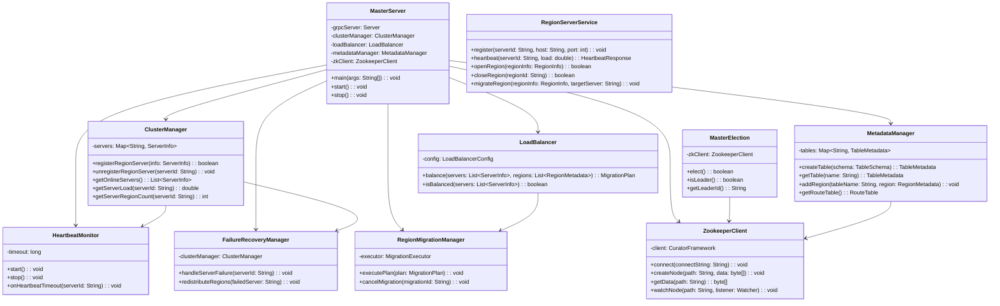
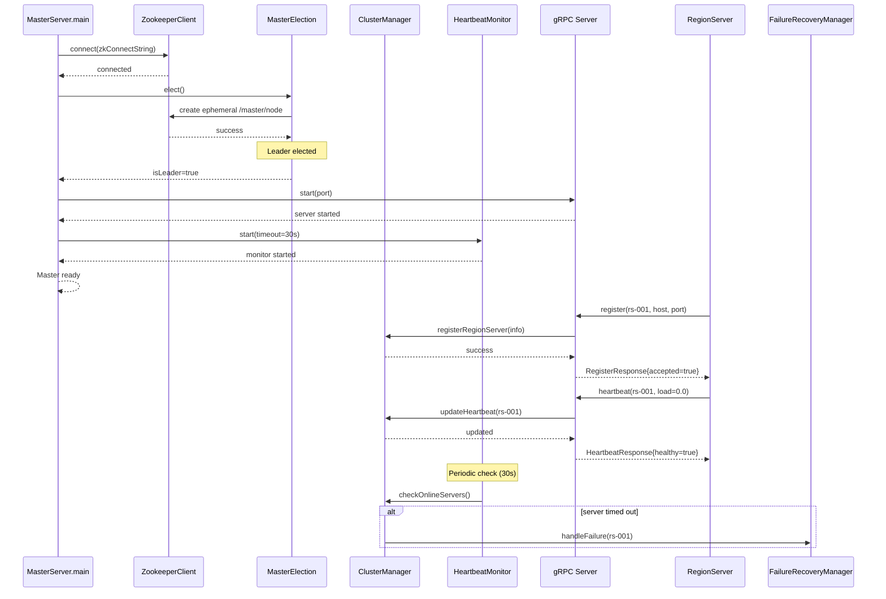
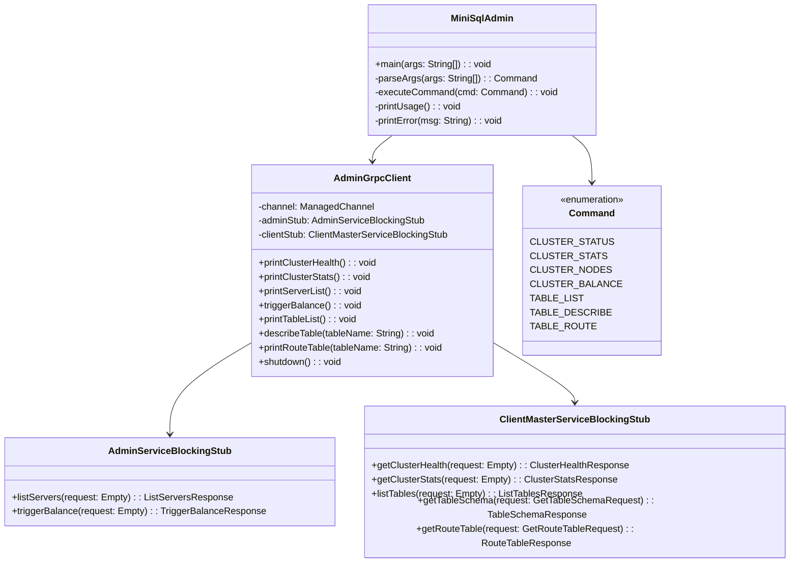
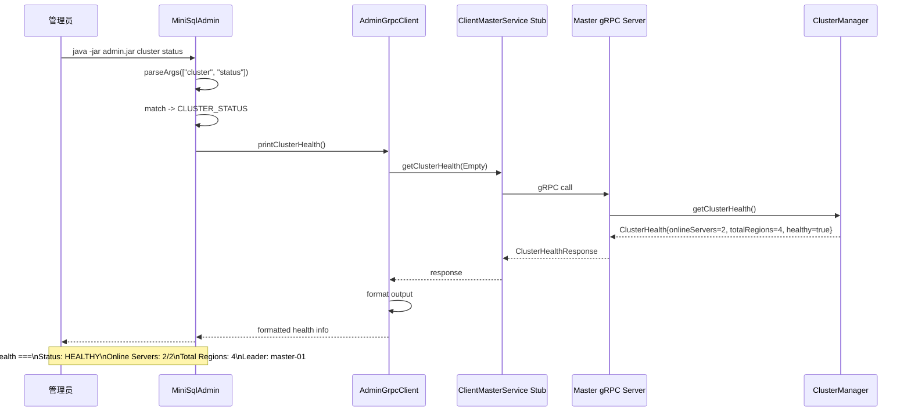
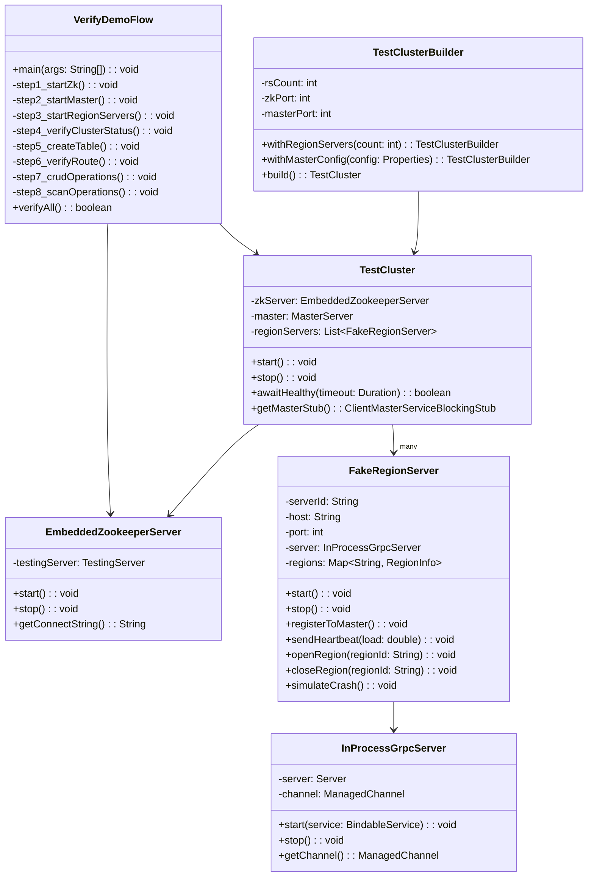
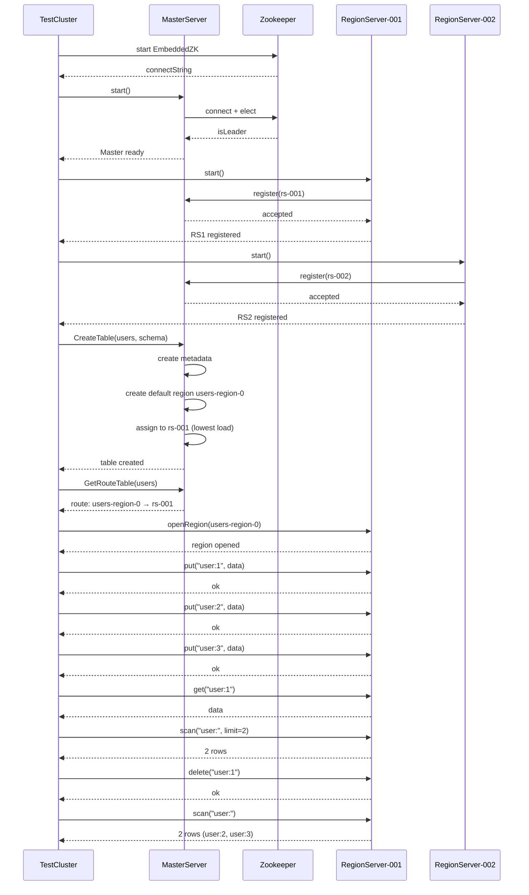
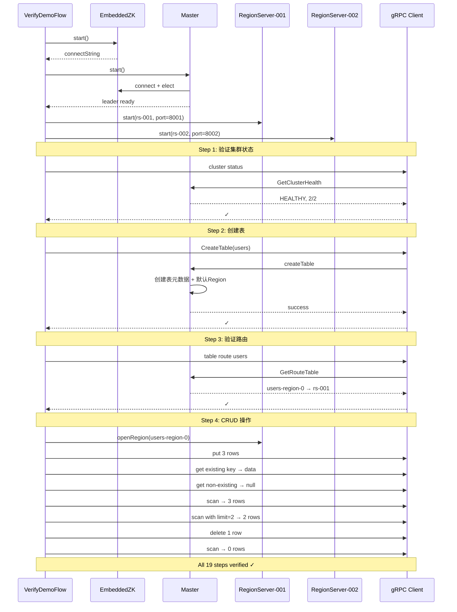
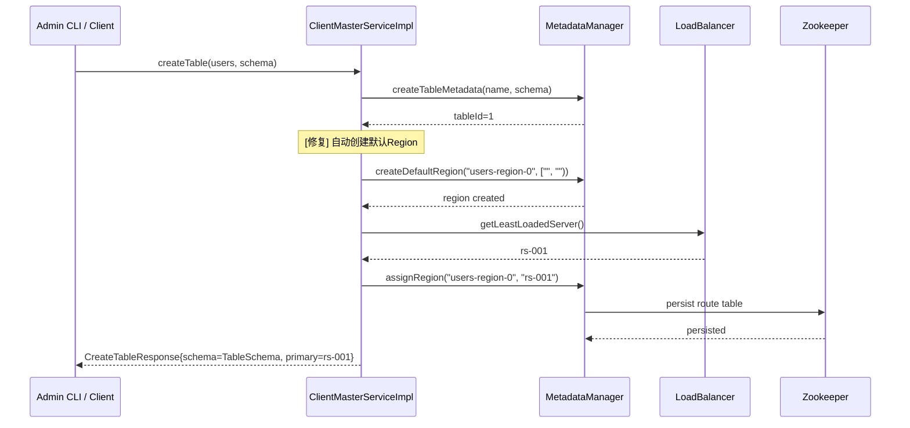

# 成员5 个人设计文档 — 总体设计、测试、工具与文档

**项目：** 分布式MiniSQL系统  
**角色：** 总体设计负责人 / 测试与工具开发负责人  
**时间：** 2026-04 — 2026-05

---

## 一、职责范围

### 1.1 总体设计报告负责人

作为团队中负责汇总和撰写总体设计报告的成员，承担以下职责：

- **收集各成员模块设计** — 收集成员1（Master模块）、成员2（RegionServer模块）、成员3（副本管理与一致性协议）、成员4（客户端与分布式查询）的模块设计信息
- **汇总形成总体设计报告** — 将各成员的模块设计文档统一整理、汇总，撰写一份完整的系统总体设计报告
- **统一文档格式与风格** — 确保各模块设计文档的格式、术语、图示风格保持一致
- **设计文档版本管理** — 维护总体设计文档的版本更新，确保与各模块实际实现同步

### 1.2 测试框架搭建与测试用例编写

负责全链路测试体系，从单元测试到系统集成测试再到性能压力测试的完整覆盖。

### 1.3 CLI 管理工具开发

`minisql-admin` 命令行工具，通过 gRPC 协议与 Master 节点通信。

### 1.4 系统部署与配置

启动/停止脚本、配置文件管理、bootstrap 工具。

### 1.5 文档编写与维护

用户手册、API 文档、部署指南、演示脚本等全部项目文档。

---

## 二、总体架构设计

作为总体设计负责人，整理了以下系统架构视图，用于团队沟通和演示说明。

### 2.1 系统总体架构

以下类图展示了分布式 MiniSQL 系统的核心模块及其关系：



### 2.2 Master 内部组件协作

以下时序图展示了 Master 启动时各组件间的协作流程：



---

## 三、CLI 管理工具 (minisql-admin)

### 3.1 设计目标

为系统管理员提供一个命令行工具，通过 gRPC 协议与 Master 节点通信，完成集群管理和表管理操作，无需编写代码或直接调用 gRPC 接口。

### 3.2 类图



### 3.3 命令执行时序

以下时序图展示 `cluster status` 命令的完整执行流程：



### 3.4 架构设计

```
用户输入 (命令行参数)
    │
    ▼
MiniSqlAdmin (入口 + 命令解析)
    │
    ▼
AdminGrpcClient (gRPC 客户端封装)
    │
    ├── AdminServiceStub  → Master 管理接口
    │
    └── ClientMasterServiceStub → Master 客户端接口
```

### 3.5 核心实现

**MiniSqlAdmin.java** — 命令入口与解析（`minisql-admin/src/main/java/com/minisql/admin/MiniSqlAdmin.java`）

- 支持 `--host` / `--port` 参数指定 Master 地址（默认 `localhost:8000`）
- 二级命令结构：`cluster <status|stats|nodes|balance>`、`table <list|describe|route>`
- 错误处理：连接失败、命令错误均有友好提示

**AdminGrpcClient.java** — gRPC 客户端封装（`minisql-admin/src/main/java/com/minisql/admin/AdminGrpcClient.java`）

| 方法 | 调用的 RPC | 功能 |
|------|-----------|------|
| `printClusterHealth()` | `ClientMasterService.GetClusterHealth` | 集群健康状态 |
| `printClusterStats()` | `ClientMasterService.GetClusterStats` | 集群统计信息 |
| `printServerList()` | `AdminService.ListServers` | 节点列表+详情 |
| `triggerBalance()` | `AdminService.TriggerBalance` | 手动触发负载均衡 |
| `printTableList()` | `ClientMasterService.ListTables` | 表列表 |
| `describeTable()` | `ClientMasterService.GetTableSchema` | 表结构详情 |
| `printRouteTable()` | `ClientMasterService.GetRouteTable` | 表路由信息 |

### 3.6 打包方式

使用 `maven-assembly-plugin` 构建 fat JAR，将所有依赖（包括 gRPC、Protobuf、Guava 等）打包为一个可独立执行的 JAR 文件：

```bash
cd minisql-admin && mvn package -DskipTests
# 输出: target/minisql-admin-1.0-SNAPSHOT-jar-with-dependencies.jar
```

---

## 四、测试体系

### 4.1 总体设计

测试分层架构，覆盖从单元到系统集成的全链路验证：

| 层级 | 工具 | 范围 | 数量 |
|------|------|------|------|
| 单元测试 | JUnit 4 + Mockito | 单个类/方法 | ~240 |
| 集成测试 | 内嵌 ZK + in-process gRPC | 模块间交互 | ~50 |
| 端到端测试 | 完整集群模拟 | 全流程 | ~10 |
| 性能测试 | 基准测试框架 | 吞吐量/延迟 | 7 |
| 压力测试 | 并发客户端 | 高负载稳定性 | 3 |
| 验收测试 | gRPC 客户端 | Demo 流程 | ~3 |
| **总计** | | | **313** |

### 4.2 测试基础设施类图



### 4.3 E2E 测试执行流程

以下时序图展示了端到端测试中 CreateTable 到数据操作的完整流程：



### 4.4 测试用例分布

#### Master 模块测试（189 个）

| 子模块 | 测试文件 | 说明 |
|--------|---------|------|
| **负载均衡** | LoadBalancerTest, LoadBalancerConfigTest, LoadBalancerIntegrationTest | 基本均衡策略、配置验证、集成测试 |
| **Region 迁移** | MigrationExecutorTest, MigrationPlanTest, MigrationTaskTest, MigrationStateTest, MigrationStatisticsTest, MigrationConfigTest, MigrationExceptionTest, RegionMigrationManagerTest, PrepareHandlerTest, SyncHandlerTest, SwitchHandlerTest, RollbackHandlerTest, SyncProgressTest | 全状态机覆盖：创建→执行→提交→回滚 |
| **集群管理** | ClusterManagerTest, ServerInfoTest | 注册、心跳、节点状态 |
| **元数据** | MetadataManagerTest | 表/Region CRUD |
| **ZK 集成** | ZookeeperClientTest | 连接、节点操作 |
| **集成/E2E** | EndToEndSmokeTest, ClientEndToEndTest, MasterRegionServerIntegrationTest, EndToEndFailoverTest, EndToEndMigrationTest, LoadBalancerEndToEndTest | 全链路验证 |
| **压力测试** | FailureRecoveryIntegrationTest, MasterElectionStressTest | 故障恢复、选举稳定性 |

#### RegionServer 模块测试（53 个）

| 子模块 | 测试文件 | 说明 |
|--------|---------|------|
| **WAL** | WalManagerTest, WalServiceCleanupTest | 日志写入/读取/清理 |
| **Paxos** | PaxosAcceptorTest, PaxosTypesTest, ReplicationTest | 一致性协议验证 |
| **服务** | RegionServerServiceImplTest | gRPC 服务接口 |

#### Client 模块测试（55 个）

| 子模块 | 测试文件 | 说明 |
|--------|---------|------|
| **连接管理** | ConnectionManagerTest | 连接池、重连 |
| **路由缓存** | RouteCacheTest | 路由缓存刷新/失效 |
| **SQL 执行** | SqlExecutorTest, NonPkWhereTest, ValueCodecTest | SQL 解析和执行 |
| **Join** | JoinExecutorTest | Hash Join 验证 |
| **网关** | GatewayServiceImplTest | Gateway RPC 服务 |
| **端到端** | MiniSQLClientTest | 客户端全流程 |
| **基准测试** | CrudBenchmarkTest | 吞吐量/延迟测量 |
| **压力测试** | ConcurrencyStressTest | 并发稳定性 |

#### Admin 模块测试（16 个）

| 测试文件 | 说明 |
|---------|------|
| MiniSqlAdminTest | CLI 命令解析和错误处理 |
| AdminGrpcClientTest | gRPC 客户端调用 |

### 4.5 性能测试设计

**CrudBenchmarkTest**（`minisql-client/src/test/java/com/minisql/client/benchmark/CrudBenchmarkTest.java`）

- 测试方法：in-process gRPC 模拟集群，预热 500 次后测量 2000 次操作的吞吐量
- 测量指标：PUT / GET / DELETE / SCAN 的 ops/sec 和平均延迟

**结果：**
| 操作 | 吞吐量 |
|------|--------|
| PUT | ~15,890 ops/sec |
| GET | ~86,237 ops/sec |
| DELETE | ~103,176 ops/sec |

**ConcurrencyStressTest**（`minisql-client/src/test/java/com/minisql/client/benchmark/ConcurrencyStressTest.java`）

- 10 线程并发混合读写
- 每线程 500 次操作，总计 5000 次
- 验证：0 错误、无数据竞争、最终一致性

**结果：** 10 线程并发混合读写 ~168K ops/sec，0 错误。

### 4.6 测试覆盖率

截至 2026-05-12 覆盖报告：

| 模块 | 测试数 | 关键子模块覆盖率 |
|------|--------|-----------------|
| minisql-master | 189 | balance 93%, cluster 85% |
| minisql-regionserver | 53 | WAL 70%, replication 49% |
| minisql-client | 55 | route 91%, core 83%, conn 77% |
| minisql-admin | 16 | 77% |
| **总计** | **313** | 全部通过 |

---

## 五、部署工具

### 5.1 启动/停止脚本

为 Master 和 RegionServer 分别设计了 Windows (.bat) 和 Linux (.sh) 两套脚本：

| 脚本 | 功能 |
|------|------|
| `minisql-master/start-master.bat` / `.sh` | 启动 Master（含 ZK 连接检查） |
| `minisql-master/stop-master.bat` / `.sh` | 优雅关闭 Master（SIGTERM → 等待 → 强制） |
| `minisql-regionserver/start-regionserver.bat` / `.sh` | 启动 RegionServer（参数：server-id, port） |
| `minisql-regionserver/stop-regionserver.bat` / `.sh` | 优雅关闭 RegionServer |

设计要点：
- `stop-*.sh` 使用 `jps` 查找 PID，先发 SIGTERM 等待 10 秒再 SIGKILL
- `stop-*.bat` 使用 `jps` + `taskkill` 实现相同逻辑
- 停止脚本支持 `--force` 参数跳过等待

### 5.2 Bootstrap 工具

`bootstrap/` 目录下的独立工具类：

| 文件 | 用途 |
|------|------|
| `ZkStart.java` | 独立启动嵌入式 ZooKeeper（用于演示前准备环境） |
| `GrpcTest.java` | gRPC 连通性测试 |
| `DemoClient.java` | 演示用客户端，展示完整的集群交互流程 |
| `GatewayClient.java` | Gateway 客户端，测试 Gateway 服务的 Ping/SQL 功能 |
| `VerifyDemoFlow.java` | **验收验证工具** — 自动执行 19 步演示流程验证 |

### 5.3 VerifyDemoFlow 验证流程



### 5.4 配置管理

维护 `regionserver.conf` 配置文件，设计为 properties 格式：

```properties
regionserver.id=rs-001
regionserver.port=8001
master.host=127.0.0.1
master.port=8000
storage.backend=memory
wal.enabled=false
regionserver.cli.enabled=true
```

关键修复：发现 `regionserver.cli.enabled=true` 未设置导致控制台 CLI 在 `mvn exec:java` 运行时不启动，修正后控制台可正常交互。

---

## 六、文档体系

项目文档统一放在 `docs/` 目录，覆盖用户、开发、部署、测试和演示五类场景：

| 文档 | 定位 | 目标读者 |
|------|------|---------|
| `user-manual.md` | 用户手册 | 系统使用人员 |
| `api-documentation.md` | API 文档 | 开发者/集成方 |
| `deployment-guide.md` | 部署指南 | 运维人员 |
| `system-test-scenarios.md` | 系统测试场景设计 | QA/测试人员 |
| `demo-plan.md` | 验收演示脚本 | 演示者 |
| `team-division.md` | 团队分工与进度 | 团队全体 |

### 6.1 用户手册 (user-manual.md)

内容涵盖：
- 系统架构图（Master-RegionServer 两层结构）
- 快速启动（构建 → 启动 ZK → Master → RegionServer → Admin CLI）
- Admin CLI 命令参考（全部 7 个命令的用法和输出示例）
- RegionServer 控制台命令参考（put/get/delete/exists/list）
- 最佳实践和故障排除

### 6.2 API 文档 (api-documentation.md)

结构：
- MasterService（RegionServer 面向）：注册、心跳、上报 metrics
- ClientMasterService（Client 面向）：表管理、集群健康、路由查询
- AdminService（Admin 面向）：节点管理、负载均衡
- RegionServerService（数据操作）：CRUD + 扫描
- 每个 RPC 包含：请求参数、响应字段、错误码

### 6.3 部署指南 (deployment-guide.md)

包含：
- 硬件和软件要求
- 生产环境配置（MySQL 后端、WAL 同步、JVM 参数）
- 性能调优（线程池、缓存、Region 参数）
- 监控和告警（日志级别、JMX）
- 故障排除 checklist

### 6.4 系统测试场景 (system-test-scenarios.md)

设计 4 大类 20+ 测试场景：

| 类别 | 场景数 | 覆盖 |
|------|--------|------|
| 正常操作 | 6 | CRUD、DDL、多 Region 扫描 |
| 集群管理 | 5 | 注册、心跳、负载均衡、迁移 |
| 故障恢复 | 5 | 节点宕机、ZK 断开、网络分区 |
| 数据一致性 | 5 | Paxos、WAL 恢复、副本同步 |

### 6.5 验收演示脚本 (demo-plan.md)

7 环节、约 20 分钟的完整演示流程：

| 环节 | 时长 | 内容 |
|------|------|------|
| 一 | 2min | 系统架构说明 |
| 二 | 3min | 集群管理命令演示 |
| 三 | 2min | 创建表和路由展示 |
| 四 | 4min | RegionServer CRUD 演示 |
| 五 | 2min | Master-RS 交互机制讲解 |
| 六 | 3min | 故障容错演示 |
| 七/八 | 2min | 多语言网关 / 命令汇总 |

---

## 七、关键问题修复

### 7.1 CreateTable 路由表缺失

**问题：** `CreateTable` 只创建表元数据，不创建任何 Region，导致 `table route` 返回空。

**修复时序图：**



**修复：** 在 `ClientMasterServiceImpl.createTable()` 中，表创建成功后自动创建默认 Region `{tableName}-region-0`（键范围 `["", "")`），并分配到最低负载的在线服务器。

### 7.2 RegionServer 控制台不注册 Region

**问题：** 控制台 CRUD 操作直接调用本地存储方法，不经过 Region 打开流程，导致心跳报告中 Region 数为 0。

**修复：** 在 `RegionServerMain.java` 的每个 `handle*` 方法前调用 `ensureDefaultRegion(table)`，自动打开 `region-001`。

### 7.3 scan RPC 未上线 Region 返回 onError

**问题：** 对未打开的 Region 执行 scan 时返回 `onError()`，导致 gRPC 客户端抛异常。

**修复：** 改为返回 `onCompleted()` 和空流，与 get/exists 行为一致。

### 7.4 控制台 CLI 默认不启动

**问题：** `regionserver.conf` 中 `regionserver.cli.enabled` 默认未设置，`mvn exec:java` 运行时不启动控制台。

**修复：** 在配置文件中添加 `regionserver.cli.enabled=true`。

---

## 八、设计决策

### 8.1 Admin CLI 使用 blocking stub 而非 reactive

**决策：** CLI 工具使用 gRPC blocking stub（同步调用）。

**理由：** CLI 是交互式/单次执行模式，无需异步回调。blocking stub 简化代码逻辑，错误处理更直观。

### 8.2 测试使用 in-process gRPC 而非真实网络

**决策：** 集成测试和性能测试使用 gRPC in-process 通道。

**理由：** （1）消除网络延迟对性能测试的影响；（2）单进程运行，简化 CI/CD；（3）避免端口冲突。

### 8.3 Fat JAR 打包 Admin CLI

**决策：** 使用 `maven-assembly-plugin` 打包 fat JAR。

**理由：** 演示环境中直接 `java -jar` 运行，无需管理 classpath。fat JAR 为 20MB（含 gRPC/Protobuf 依赖）。

### 8.4 嵌入式 ZK 而非外部 ZK 服务

**决策：** 测试和 bootstrap 工具使用 Curator TestingServer 内嵌 ZooKeeper。

**理由：** 不依赖外部 ZK 安装，测试可独立运行。验证演示脚本 (`VerifyDemoFlow.java`) 也使用嵌入式 ZK，实现一键全流程验证。

---

## 九、经验总结

1. **测试即文档：** 好的测试既是质量保障，也是代码的使用示例。`VerifyDemoFlow.java` 既是一个自动化的测试工具，也完整展示了系统各模块的集成方式。

2. **演示驱动开发：** 按照 `demo-plan.md` 的步骤来设计测试用例，确保每个演示环节都有对应的自动化验证，避免演示时出问题。

3. **分层测试策略：** 单元测试保证逻辑正确性，集成测试保证模块间协作，E2E 测试保证用户场景可用，性能测试保证非功能性需求。四层缺一不可。

4. **配置管理陷阱：** `regionserver.cli.enabled=true` 这样的配置项容易被遗漏。建议所有功能开关在配置文件中显式设置。

5. **总体设计文档汇总：** 作为总体设计报告负责人，需要主动与各成员沟通，及时收集各模块设计文档，确保汇总后的设计报告完整、准确地反映系统全貌。

---

## 十、文件清单

### 创建的文件

| 文件 | 模块 | 行数 |
|------|------|------|
| `minisql-admin/src/main/java/com/minisql/admin/MiniSqlAdmin.java` | admin | 135 |
| `minisql-admin/src/main/java/com/minisql/admin/AdminGrpcClient.java` | admin | 213 |
| `minisql-admin/src/main/resources/application.properties` | admin | — |
| `minisql-admin/pom.xml` | admin | — |
| `minisql-admin/src/assembly/fatjar.xml` | admin | — |
| `minisql-admin/src/test/java/com/minisql/admin/MiniSqlAdminTest.java` | admin-test | — |
| `minisql-admin/src/test/java/com/minisql/admin/AdminGrpcClientTest.java` | admin-test | — |
| `minisql-master/start-master.bat` | deploy | — |
| `minisql-master/start-master.sh` | deploy | — |
| `minisql-master/stop-master.bat` | deploy | — |
| `minisql-master/stop-master.sh` | deploy | — |
| `minisql-regionserver/start-regionserver.bat` | deploy | — |
| `minisql-regionserver/start-regionserver.sh` | deploy | — |
| `minisql-regionserver/stop-regionserver.bat` | deploy | — |
| `minisql-regionserver/stop-regionserver.sh` | deploy | — |
| `bootstrap/ZkStart.java` | bootstrap | — |
| `bootstrap/GrpcTest.java` | bootstrap | — |
| `bootstrap/DemoClient.java` | bootstrap | — |
| `bootstrap/GatewayClient.java` | bootstrap | — |
| `bootstrap/VerifyDemoFlow.java` | bootstrap | 310 |
| `docs/user-manual.md` | docs | — |
| `docs/api-documentation.md` | docs | — |
| `docs/deployment-guide.md` | docs | — |
| `docs/system-test-scenarios.md` | docs | — |
| `docs/demo-plan.md` | docs | — |
| `minisql-client/src/test/java/com/minisql/client/benchmark/CrudBenchmarkTest.java` | benchmark | — |
| `minisql-client/src/test/java/com/minisql/client/benchmark/ConcurrencyStressTest.java` | benchmark | — |

### 修改的文件

| 文件 | 变更 |
|------|------|
| `minisql-master/src/main/java/com/minisql/master/service/ClientMasterServiceImpl.java` | createTable 自动创建默认 Region |
| `minisql-regionserver/src/main/java/com/minisql/regionserver/RegionServerMain.java` | handle* 自动打开默认 Region |
| `minisql-regionserver/src/main/java/com/minisql/regionserver/service/RegionServerServiceImpl.java` | scan 返回空流而非 onError |
| `minisql-regionserver/src/main/resources/regionserver.conf` | 启用 CLI |
| `docs/team-division.md` | 持续更新团队分工和进度 |
| `docs/demo-plan.md` | 更新预期输出以匹配修复后行为 |
| `pom.xml` | 根 POM 配置 |
| `minisql-regionserver/pom.xml` | 构建配置 |

---

---
