# 分布式 MiniSQL 系统总体设计报告

**文档版本：** v1.0
**创建日期：** 2026-05-13
**负责人：** 刘一鸣（成员5）— 总体设计报告汇总

---

## 目录

1. [概述](#1-概述)
2. [团队分工](#2-团队分工)
3. [系统总体架构](#3-系统总体架构)
4. [Master 模块设计](#4-master-模块设计)
5. [RegionServer 模块设计](#5-regionserver-模块设计)
6. [副本管理与一致性协议模块设计](#6-副本管理与一致性协议模块设计)
7. [Client 模块设计](#7-client-模块设计)
8. [测试体系与工具](#8-测试体系与工具)
9. [部署架构](#9-部署架构)
10. [系统总览与总结](#10-系统总览与总结)

---

## 1. 概述

### 1.1 项目背景

Distributed MiniSQL 是一个教学用途的分布式关系型数据库系统，采用 **Master-RegionServer** 两层架构，支持数据分片、副本管理、负载均衡、分布式查询等核心功能。系统使用 MySQL 作为底层存储引擎，在其之上构建分布式层，通过 gRPC + Protobuf 实现各节点间的通信。

### 1.2 系统设计目标

**功能目标：**
- 支持数据分片（Range-Based Partitioning）和分布式存储
- 支持多副本复制和强一致性保证（Paxos 共识协议）
- 支持 Master 高可用和故障自动转移
- 支持负载均衡和 Region 在线迁移
- 支持分布式查询（并行扫描、Hash Join）
- 支持多语言接入（Gateway gRPC 服务）

**性能目标：**
- 单表点查询端到端延迟 < 10ms
- Master 心跳处理延迟 < 50ms
- Master 选举时间 < 5s

**可靠性目标：**
- Master 可用性 > 99.9%
- 数据多副本强一致性
- 故障自动恢复

### 1.3 技术栈

| 技术 | 用途 |
|------|------|
| Java 11/17 | 开发语言 |
| gRPC + Protobuf 3 | RPC 通信与数据序列化 |
| Apache ZooKeeper 3.9 | 分布式协调、Master 选举、元数据存储 |
| Maven | 构建工具 |
| JUnit 4 + Mockito | 单元测试与 Mock |
| MySQL (JDBC/HikariCP) | 持久化存储引擎 |
| SLF4J + Logback | 日志框架 |
| JSqlParser 4.x | SQL 解析 |

---

## 2. 团队分工

本系统由 5 人团队协作完成，各成员分工如下：

| 成员 | 角色 | 负责模块 | 核心职责 |
|------|------|---------|---------|
| **成员1** 李明睿 | Master 模块开发 | `minisql-master` | 集群管理、元数据管理、负载均衡、Region 迁移、Master 选举、ZooKeeper 集成 |
| **成员2** 李锋然 | RegionServer 模块开发 | `minisql-regionserver`（服务层+存储层） | 数据存储引擎、CRUD 操作、Region 生命周期管理、gRPC 服务实现 |
| **成员3** 周赫 | 副本管理与一致性协议 | `minisql-regionserver`（副本层） | WAL 日志系统、Paxos 共识协议、副本管理、日志复制服务 |
| **成员4** 冯俊翰 | 客户端与分布式查询 | `minisql-client` | 路由缓存、KV 门面、SQL 解析与执行、Hash Join、Gateway 多语言接入 |
| **成员5** 刘一鸣 | 总体设计负责人 / 测试与工具 | `minisql-admin` + 测试 + 文档 | 总体设计报告汇总、CLI 管理工具、测试框架、部署脚本、文档体系 |

系统代码模块依赖关系：

```
minisql-common (proto 定义，所有模块依赖)
    ├── minisql-master (成员1)
    ├── minisql-regionserver (成员2 + 成员3)
    └── minisql-client (成员4)
        └── minisql-admin (成员5)
```

---

## 3. 系统总体架构

### 3.1 系统架构总览

```
┌─────────────────────────────────────────────────────────────────────┐
│                       应用 / CLI / 多语言客户端                       │
│             Java API 直连          gRPC（Gateway）                   │
└────────────────────────┬──────────────────────────┬──────────────────┘
                         │                          │
┌────────────────────────▼──────────────────────────▼──────────────────┐
│                          Client 模块 (成员4)                          │
│   ┌──────────────┐   ┌──────────────┐   ┌────────────────────────┐  │
│   │ RouteCache   │   │  SqlExecutor │   │    Gateway Server      │  │
│   │ 路由缓存+重试│   │ SQL解析+执行 │   │  多语言接入 gRPC 服务  │  │
│   └──────┬───────┘   └──────┬───────┘   └──────────┬─────────────┘  │
│          │                  │                       │                │
│   ┌──────▼──────────────────▼───────────────────────▼──────────┐    │
│   │                 MiniSQLClient (KV 门面)                     │    │
│   │       put/get/delete/scan/exists + ParallelScanner         │    │
│   └────────────────────────────────┬───────────────────────────┘    │
└────────────────────────────────────┼─────────────────────────────────┘
                                     │
            ┌────────────────────────┼────────────────────────┐
            │                        │                        │
      ┌─────▼──────┐         ┌───────▼────────┐      ┌───────▼───────┐
      │  Master    │         │  RegionServer  │      │  RegionServer │
      │  (成员1)   │◄───────►│  (成员2+成员3) │......│  (成员2+成员3)│
      │ gRPC :8000 │ 心跳    │  gRPC :8001    │      │  gRPC :8002   │
      └─────┬──────┘  注册   └────────────────┘      └───────────────┘
            │
      ┌─────▼──────┐
      │ ZooKeeper  │
      │ :2181      │
      └────────────┘
```

### 3.2 模块依赖关系

```
LoadBalancer (成员1)
    ↓ 依赖
RegionMigrationManager (成员1)
    ↓ 依赖
ClusterManager (成员1) ←── HeartbeatMonitor (成员1)
    ↓ 依赖
ZookeeperClient (成员1) ←── MasterElection (成员1)

RegionServerServiceImpl (成员2)
    ├── RegionManager → Region → StorageEngine (MySQL/Memory)
    ├── WalService (成员3)
    ├── PaxosProposer / PaxosAcceptor (成员3)
    ├── ReplicationManager (成员3)
    └── ReplicationLogService (成员3)

MiniSQLClient (成员4)
    ├── RouteCache ←── ClientMasterService (Master gRPC)
    ├── ConnectionManager → RegionServerService (RS gRPC)
    ├── SqlExecutor → JSqlParser
    └── JoinExecutor (Hash Join)
```

### 3.3 核心数据流

以下时序图展示了一次写操作从客户端到存储的完整数据流：

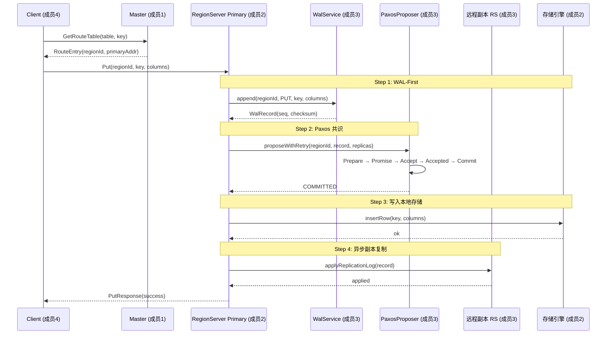

---

## 4. Master 模块设计

> 本节内容引用自 [member1-design.md](./member1-design.md)，由成员1（李明睿）完成。

### 4.1 模块定位

Master 模块是分布式 MiniSQL 的核心控制节点，负责集群管理、元数据管理、负载均衡和 Region 迁移、高可用和故障转移。

### 4.2 核心组件类图

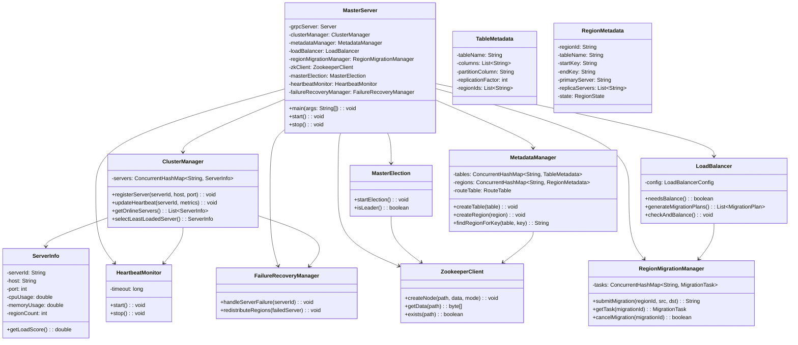

### 4.3 Master 启动与选举流程

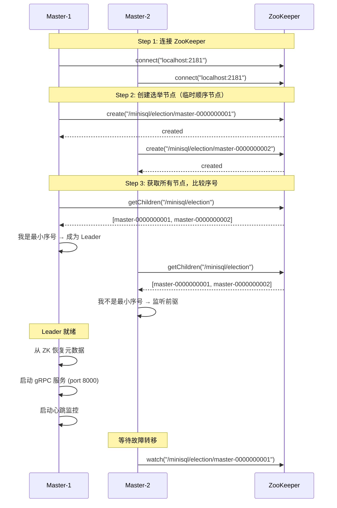

### 4.4 负载均衡与 Region 迁移

Master 的负载均衡器使用加权负载评分算法，当检测到节点间负载差异超过阈值时自动触发 Region 迁移。

**迁移状态机：**

```
PENDING → PREPARING → SYNCING → SWITCHING → COMPLETED
                ↓         ↓          ↓
              FAILED ← FAILED ← FAILED
                ↓
            ROLLING_BACK → ROLLED_BACK
```

**负载评分公式：**

```
loadScore = cpuUsage × 0.3 + memoryUsage × 0.3 + diskUsage × 0.4
```

详细设计请参见 [member1-design.md §3.3](./member1-design.md) 和 [member1-design.md §3.4](./member1-design.md)。

### 4.5 gRPC 接口

Master 提供两组 gRPC 服务：

- **MasterService**（面向 RegionServer）：注册、心跳、迁移控制
- **ClientMasterService**（面向 Client）：建表、路由查询、表信息

详细接口定义请参见 [member1-design.md §4](./member1-design.md)。

---

## 5. RegionServer 模块设计

> 本节内容引用自 [member2-design.md](./member2-design.md)，由成员2（李锋然）完成。

### 5.1 模块定位

RegionServer 是分布式 MiniSQL 系统的核心数据节点，负责实际的数据存储、查询执行以及 Region 的生命周期管理。

### 5.2 核心组件类图

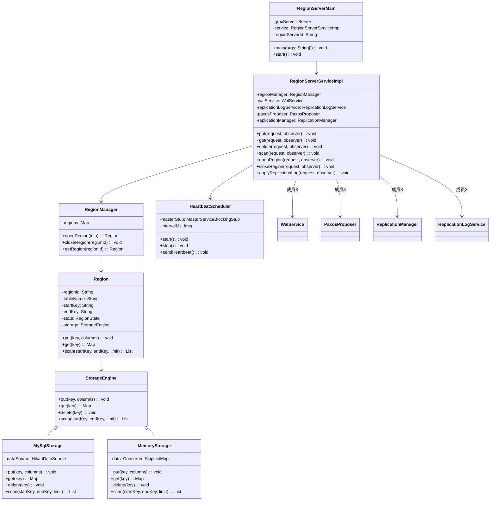

### 5.3 Region 生命周期状态机

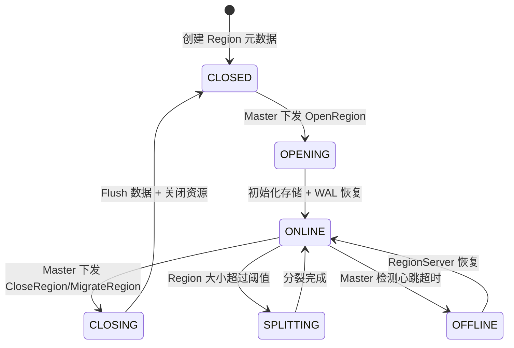

### 5.4 存储引擎设计

RegionServer 采用策略模式，支持两种存储后端：

- **MySQL 存储** (`MySqlStorage`)：使用 HikariCP 连接池，每个 Region 对应一张物理表
- **内存存储** (`MemoryStorage`)：使用 `ConcurrentSkipListMap`，适用于测试和快速原型

详细设计请参见 [member2-design.md §3.3](./member2-design.md)。

### 5.5 gRPC 接口

RegionServerService 提供的数据操作接口：

| 方法 | 描述 |
|------|------|
| `Put` | 插入或更新单行数据 |
| `Get` | 查询单行数据 |
| `Delete` | 删除单行数据 |
| `Scan` | 范围扫描（服务端流式） |
| `OpenRegion` | 加载 Region |
| `CloseRegion` | 卸载 Region |
| `ApplyReplicationLog` | 副本间同步 WAL |

详细接口定义请参见 [member2-design.md §4](./member2-design.md)。

---

## 6. 副本管理与一致性协议模块设计

> 本节内容引用自 [member3-design.md](./member3-design.md)，由成员3（周赫）完成。

### 6.1 模块定位

本模块位于 RegionServer 节点内部，承担副本管理、Paxos 共识协议和 WAL 日志系统的核心职责。

### 6.2 模块在 RegionServer 中的位置

```
┌─────────────────────────────────────────────────────────────┐
│                       RegionServer                           │
│  ┌──────────────────────────────────────────────────────┐  │
│  │               RegionServerServiceImpl                │  │
│  │         (gRPC 入口，协调所有子模块)                     │  │
│  └────┬──────────┬────────────┬────────────┬───────────┘  │
│       │          │            │            │                │
│  ┌────▼───┐ ┌───▼────┐ ┌────▼────┐ ┌─────▼──────┐         │
│  │ Store  │ │Replicat│ │  Paxos  │ │    WAL     │         │
│  │(MySQL/ │ │ Manager│ │Protocol │ │   System   │         │
│  │Memory) │ │        │ │         │ │            │         │
│  └────────┘ └───▲────┘ └────▲────┘ └─────▲──────┘         │
│                 │            │            │                │
│                 └────────────┴────────────┘                │
│                     成员3 负责范围                           │
└─────────────────────────────────────────────────────────────┘
```

### 6.3 核心组件类图

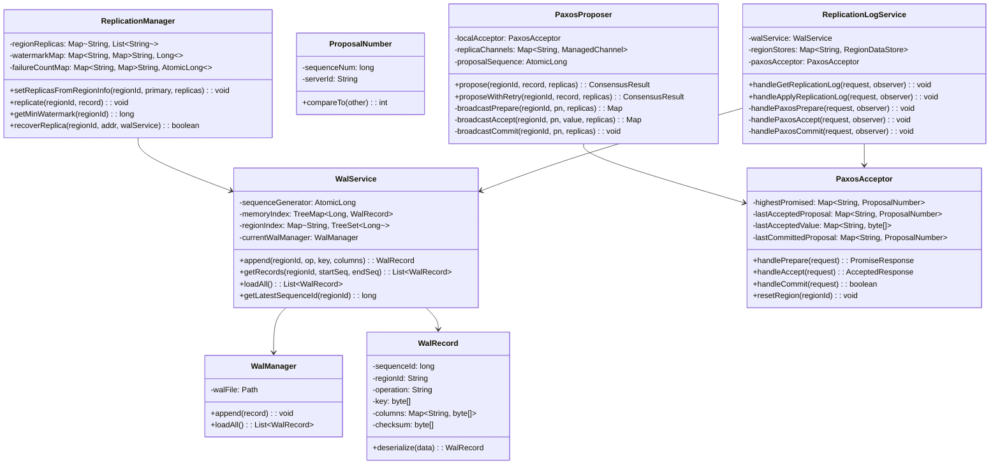

### 6.4 Paxos 三阶段共识流程

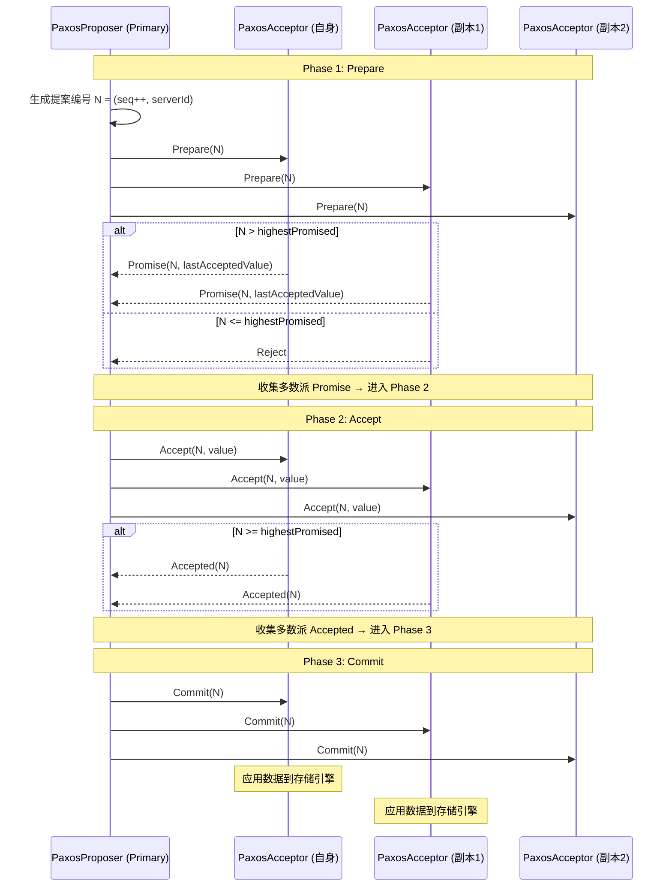

### 6.5 WAL-First 写操作完整流程

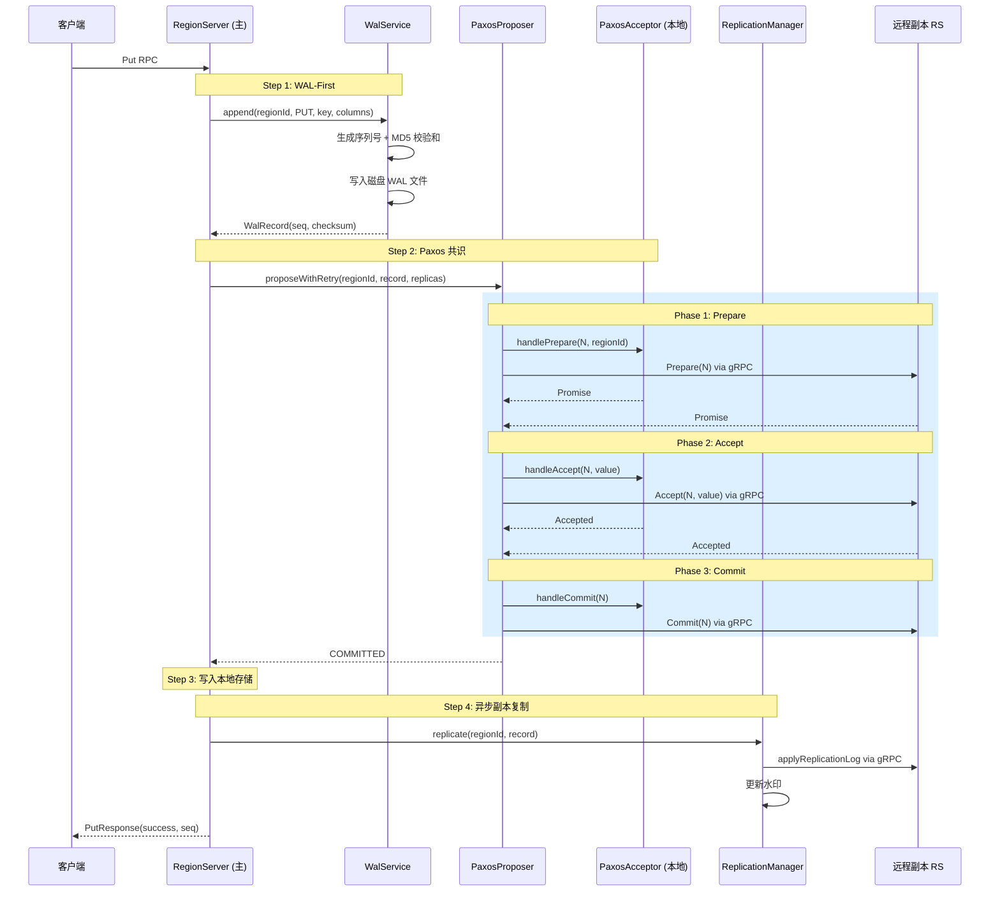

详细设计请参见 [member3-design.md §3.2](./member3-design.md)（Paxos 共识协议）和 [member3-design.md §3.1](./member3-design.md)（WAL 日志系统）。

---

## 7. Client 模块设计

> 本节内容引用自 [member4-design.md](./member4-design.md)，由成员4（冯俊翰）完成。

### 7.1 模块定位

Client 模块是 Distributed MiniSQL 面向上层应用的接入层，负责屏蔽集群拓扑、提供两层 API（低层 KV 与高层 SQL）、分布式查询执行和多语言支持。

### 7.2 核心组件类图

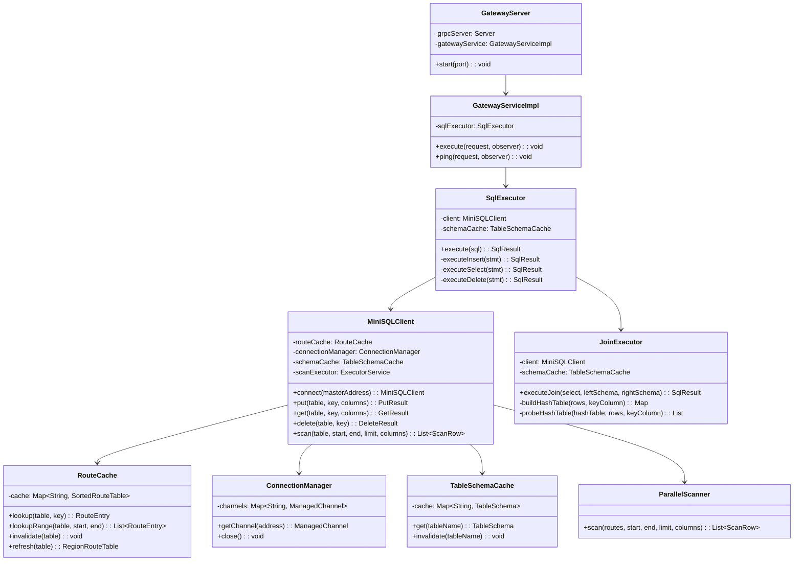

### 7.3 SQL 执行流程

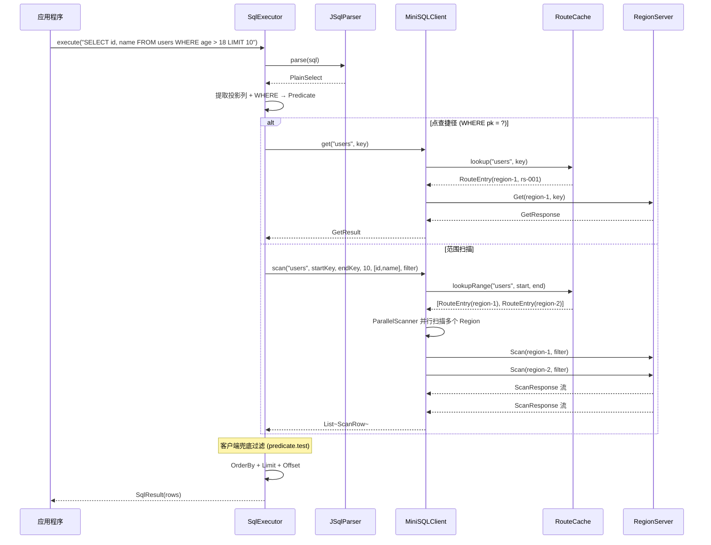

### 7.4 Hash Join 流程

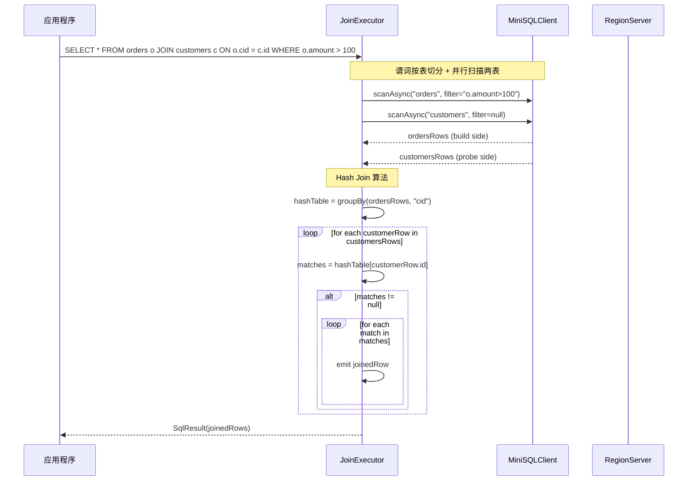

### 7.5 路由失效自动恢复机制

Client 在检测到 `ERROR_STALE_ROUTE` 时自动执行一次路由刷新和重试：

```
1. RouteCache.lookup(table, key) → RouteEntry
2. 向 RegionServer 发起 RPC
3. 若响应 errorCode == ERROR_STALE_ROUTE：
   a. RouteCache.invalidate(table)
   b. 重新 lookup（触发 GetRouteTable RPC）
   c. 用新路由重试一次（只重试一次，避免死循环）
4. 返回最终响应
```

详细设计请参见 [member4-design.md §3.2](./member4-design.md)（路由缓存）和 [member4-design.md §3.7](./member4-design.md)（Hash Join）。

---

## 8. 测试体系与工具

> 本节内容引用自 [member5-design.md](./member5-design.md)，由成员5（刘一鸣）完成。

### 8.1 测试分层架构

| 层级 | 工具 | 范围 | 数量 |
|------|------|------|------|
| 单元测试 | JUnit 4 + Mockito | 单个类/方法 | ~240 |
| 集成测试 | 内嵌 ZK + in-process gRPC | 模块间交互 | ~50 |
| 端到端测试 | 完整集群模拟 | 全流程 | ~10 |
| 性能测试 | 基准测试框架 | 吞吐量/延迟 | 7 |
| 压力测试 | 并发客户端 | 高负载稳定性 | 3 |
| **总计** | | | **~310** |

### 8.2 测试基础设施类图

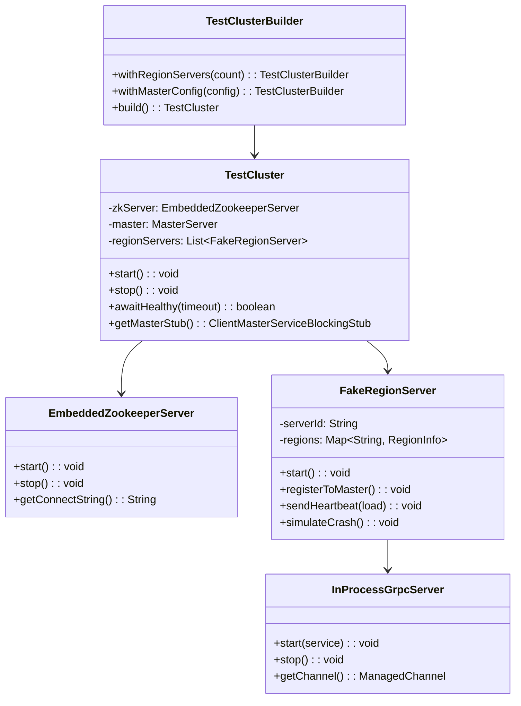

### 8.3 CLI 管理工具

`minisql-admin` 命令行工具提供 7 个管理命令：

| 命令 | 功能 |
|------|------|
| `cluster status` | 集群健康状态 |
| `cluster stats` | 集群统计信息 |
| `cluster nodes` | 节点列表+详情 |
| `cluster balance` | 手动触发负载均衡 |
| `table list` | 表列表 |
| `table describe <name>` | 表结构详情 |
| `table route <name>` | 表路由信息 |

### 8.4 性能测试结果

| 操作 | 吞吐量 |
|------|--------|
| PUT | ~15,890 ops/sec |
| GET | ~86,237 ops/sec |
| DELETE | ~103,176 ops/sec |
| 10 线程并发混合读写 | ~168,000 ops/sec（0 错误） |

详细设计请参见 [member5-design.md §3](./member5-design.md)（Admin 工具）和 [member5-design.md §4](./member5-design.md)（测试体系）。

---

## 9. 部署架构

### 9.1 部署拓扑

```
┌────────────────────────────────────────────┐
│         ZooKeeper Cluster (3节点)          │
│   zk-1:2181  zk-2:2181  zk-3:2181         │
└─────────────────┬──────────────────────────┘
                  │
    ┌─────────────┼─────────────┐
    │             │             │
┌───▼────┐   ┌───▼────┐   ┌───▼────┐
│Master-1│   │Master-2│   │Master-3│
│(Leader)│   │(Backup)│   │(Backup)│
│ :8000  │   │ :8001  │   │ :8002  │
└────────┘   └────────┘   └────────┘
    │             │             │
    └─────────────┼─────────────┘
                  │
    ┌─────────────┼─────────────┐
    │             │             │
┌───▼────┐   ┌───▼────┐   ┌───▼────┐
│   RS   │   │   RS   │   │   RS   │
│ :8001  │   │ :8002  │   │ :8003  │
└────────┘   └────────┘   └────────┘
```

### 9.2 启动顺序

1. 启动 ZooKeeper 集群
2. 启动 Master 节点（自动选举 Leader）
3. 启动 RegionServer 节点（向 Master 注册）
4. 启动 Client / Gateway 服务

详细部署步骤请参见 [member5-design.md §5](./member5-design.md) 和 [member1-design.md §10](./member1-design.md)。

---

## 10. 系统总览与总结

### 10.1 各模块完成情况

| 模块 | 负责人 | 完成度 | 关键实现 |
|------|--------|--------|---------|
| **Master** | 成员1 李明睿 | ✅ 已完成 | 集群管理、元数据管理、负载均衡、Region 迁移、Master 选举 |
| **RegionServer** | 成员2 李锋然 | ✅ 已完成 | 存储引擎（MySQL/Memory）、CRUD 操作、Region 生命周期 |
| **副本与一致性** | 成员3 周赫 | ✅ 已完成 | WAL 日志、Paxos 共识、副本管理、日志复制 |
| **Client** | 成员4 冯俊翰 | ✅ 已完成 | 路由缓存、KV 门面、SQL 执行、Hash Join、Gateway |
| **测试与工具** | 成员5 刘一鸣 | ✅ 已完成 | CLI 管理工具、测试框架（~310 测试）、部署脚本、文档 |

### 10.2 模块间交互关系汇总

```
Client (成员4)
  │ ClientMasterService (gRPC)
  ▼
Master (成员1) ──ZooKeeper── MetadataPersistence
  │ MasterService (gRPC: 注册/心跳/迁移)
  ▼
RegionServer Service (成员2)
  ├── StorageEngine (成员2: MySQL/Memory)
  ├── WalService (成员3: WAL 日志)
  ├── PaxosProposer/Acceptor (成员3: 共识)
  ├── ReplicationManager (成员3: 副本管理)
  └── ReplicationLogService (成员3: 日志复制)
       │ ApplyReplicationLog (gRPC)
       ▼
  远程副本 RegionServer
```

### 10.3 总体测试统计

| 模块 | 测试数 | 关键覆盖率 |
|------|--------|-----------|
| minisql-master | 189 | balance 94%, cluster 57% |
| minisql-regionserver | 53 | WAL 70%, replication 49% |
| minisql-client | 55 | route 91%, core 83% |
| minisql-admin | 16 | 77% |
| **总计** | **~313** | **全部通过** |

### 10.4 技术亮点

1. **完整 Master 选举机制**：基于 ZooKeeper 临时顺序节点，选举时间 < 5s，支持故障自动转移
2. **负载均衡与 Region 在线迁移**：加权负载评分 + 完整状态机（Prepare → Sync → Switch → Complete），支持自动重试和回滚
3. **Paxos 强一致性共识**：三阶段 Prepare-Accept-Commit 协议，指数退避防活锁，per-Region 隔离
4. **WAL-First 持久化保证**：所有写操作先写日志，配合 Paxos 共识，故障恢复时可重放未提交操作
5. **分布式查询能力**：并行扫描跨 Region 并发 + Hash Join 两表关联 + 谓词下推 + 路由失效自动重试
6. **Gateway 多语言接入**：非 Java 语言通过 gRPC Gateway 使用全部功能，无需复刻路由/重试/Join 逻辑

---

## 附录

### A. 各成员模块设计报告

| 报告 | 作者 | 内容 |
|------|------|------|
| [member1-design.md](./member1-design.md) | 成员1 李明睿 | Master 模块完整设计 |
| [member2-design.md](./member2-design.md) | 成员2 李锋然 | RegionServer 模块详细设计 |
| [member3-design.md](./member3-design.md) | 成员3 周赫 | 副本管理与一致性协议模块设计 |
| [member4-design.md](./member4-design.md) | 成员4 冯俊翰 | Client 模块完整设计 |
| [member5-design.md](./member5-design.md) | 成员5 刘一鸣 | 测试、工具与文档设计 |

### B. 代码仓库

- GitHub: https://github.com/oi35/Distributed_MiniSQL
- 模块目录：`minisql-master/`, `minisql-regionserver/`, `minisql-client/`, `minisql-admin/`, `minisql-common/`
